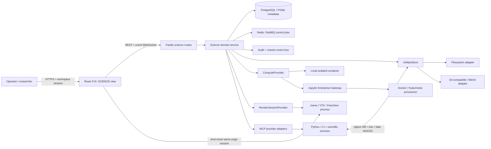
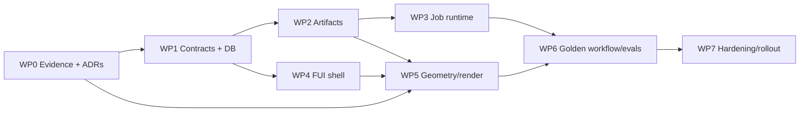

# Puppetmaster Scientific & Engineering Operations Subsystem

**Version:** 0.1  
**Date:** 2026-07-28  
**Status:** Locally implemented control-plane vertical slice; MVP definition of done and production release gates **NOT MET**  
**Working name:** Science Operations (`SCIENCE` in the UI, `science.*` in APIs/tools)

## 0. Executive decision

Build the platform as a **decoupled Puppetmaster subsystem**, not as a standalone product and
not as a second application stack inside Puppetmaster.

Puppetmaster remains the control plane for identity, workspace RBAC, approvals, missions,
workflow/agent orchestration, audit, and the React/FUI shell. Scientific Python/C++ workloads
run in isolated provider services or kernels. MCP carries bounded commands and artifact
references; object storage, HTTP range requests, rendering WebSockets, and (later) ADIOS2 carry
bulk data.

The first release is a **reproducible computational-study vertical slice**:

1. Create a study.
2. Ingest and version a dataset, notebook, or STEP model.
3. Inspect metadata and, for supported geometry, a browser preview.
4. Configure, authorize, and submit a containerized notebook computation.
5. Observe durable status, logs, progress, resource use, and cost/usage where measured.
6. Inspect a small client-rendered result or open an isolated remote visualization session.
7. Capture an immutable manifest linking inputs, code, parameters, environment digest, outputs,
   actor, approvals, and checksums.
8. Re-run from that manifest and compare the resulting provenance.

This is intentionally narrower than the source catalogue. A single release cannot credibly
rebuild OSF, a cloud CAE suite, JupyterHub, ParaView Web, Physics AI, human-subject fraud
defense, and executable publishing at once.

## 1. How to read the source material

The three source documents serve different purposes:

| Source | Use in this plan | Important qualification |
|---|---|---|
| `1. Digital Platforms for Scientific and Engineering Research.md` | Domain landscape and long-term capability map | It is research context, not a bounded product specification; unresolved image placeholders make several quantitative claims unusable as targets. |
| `2. Digital Platform Technical Implementation Plan.md` | Catalogue of possible services: storage, kernels, visualization, CAD/mesh, I/O, AI, governance, publishing | Its Django/RabbitMQ/AngularJS stack conflicts with the actual Puppetmaster architecture and must not be copied. Vendor examples are options, not requirements. |
| `3. Based on the result of Digital Platform Technical....md` | Architecture decision to integrate as a Puppetmaster subsystem | Its claims that MCP and trame-react make integration “seamless” are too broad; explicit control/data-plane, session, auth, and lifecycle contracts are still required. |

Repository evidence used to shape the plan:

- `docs/ARCHITECTURE.md`: TypeScript/Fastify/React, PostgreSQL, Redis/BullMQ, MCP, missions,
  approvals, audit, workbenches, and current deployment limits.
- `docs/DESIGN-LANGUAGE.md`: the FUI grammar and accessibility intent.
- `docs/NEXUS.md`: the task-registry contract, floating task panes, data-bound Construct, and
  real-time operator model.
- `packages/shared/src/types.ts`, `packages/db/src/schema.ts`, and
  `packages/db/src/client.ts`: shared contracts, Drizzle schema, PGlite/PostgreSQL-compatible
  idempotent DDL.
- `packages/kernel/src/mcp.ts`, `packages/kernel/src/tools.ts`, and
  `packages/kernel/src/queue.ts`: current tool and queue seams.
- `apps/server/src/main.ts`: workspace-scoped REST, RBAC, audit, and WebSocket patterns.
- `packages/ui/src/index.tsx`, `packages/ui/styles.css`, `apps/web/src/App.tsx`, and
  `apps/web/src/fui.css`: shipped FUI primitives and shell behavior.

## 2. Scope and release boundaries

### 2.1 MVP: reproducible computational-study loop

| Capability | MVP outcome |
|---|---|
| Study control plane | Workspace-scoped studies with lifecycle, owner/creator, classification, and optional link to a Workshop software project. |
| Artifact management | Streaming upload, immutable versions, SHA-256 verification, metadata, format detection, provenance roles, range download, and retention state. |
| Compute | One local/container provider plus a proven Jupyter Enterprise Gateway adapter; immutable image digests and bounded CPU/memory/GPU requests. |
| Job lifecycle | Durable submit/approve/queue/provision/run/finalize/cancel/recover flow with idempotency and stale-worker fencing. |
| Agent/workflow access | Bounded `science.*` tools using the same service layer as REST; tool results contain metadata and references, never large arrays. |
| Visualization | Client-side preview for bounded assets and an authenticated, expiring remote-render session behind a same-origin gateway. |
| Provenance | Immutable run manifest and input/output graph sufficient to explain and re-submit a run. “Reproducible” means traceable and re-runnable, not automatically bitwise-identical. |
| FUI | A Science Operations view, NEXUS task entries, live run dossier, meaningful instruments, approval ceremony, accessible fallbacks, and user-persisted layout. |

### 2.2 Explicitly deferred tracks

Each item below needs its own validated problem statement, ADR, threat model, representative
test corpus, and release gate. None is an MVP dependency.

- Multi-provider cloud-drive federation. Implement an internal `ArtifactStore` contract first;
  do not adopt WaterButler directly because its current documentation says it is only used
  internally for OSF.
- Production CAD repair, volumetric meshing, persistent topology naming, and solver-specific
  associativity.
- Commercial NASTRAN/ANSYS/SAMCEF integrations and license brokering.
- ADIOS2/SST, Catalyst, in-situ rendering, WAN/RDMA tuning, and petabyte claims.
- Physics-informed surrogate training/inference and automated model-selection policy.
- DOI minting, ORCID/ROR, preregistration, executable manuscripts, and archival web/PDF output.
- Sensor/edge ingestion.
- Human-subject recruitment, behavioral fingerprinting, or automated fraud adjudication.
- Per-study external collaboration, regulated/sensitive datasets, and active-active multi-host
  execution.

### 2.3 Pilot defaults unless the owner overrides them

- Deployment: Docker Compose on one trusted host; Kubernetes is a provider target, not an MVP
  prerequisite.
- Data classification: non-regulated research data only. Sensitive human, health, export-
  controlled, or defense data is refused until per-study access, retention, consent, and policy
  controls are separately delivered.
- Workload: Python notebook plus VTK-compatible output; no commercial solver dependency.
- Geometry: STEP preview/tessellation only; the original file is still uploaded before any
  server-side compute.
- Storage: filesystem adapter for development and tests, S3-compatible adapter/MinIO for the
  deployment profile.
- Success targets: set from a representative corpus and measured baseline in WP0. Do not invent
  “exascale,” browser-memory, latency, or concurrency targets from the source prose.

## 3. Users, permissions, and critical workflows

Reuse the existing workspace roles rather than introducing an unproven parallel role system.

| Role | Science permissions in v1 |
|---|---|
| member | List/read permitted studies, artifacts, runs, manifests, logs, visualizations, and the redacted workspace-admission decision. |
| builder | In an admitted workspace, create/update studies, upload artifacts, draft and submit runs, start render sessions, and re-run a manifest. |
| admin/owner | Configure compute/storage profiles, quotas, image allowlists, retention, provider credentials, and reasoned workspace admission/revocation. |

Risk-bearing operations retain the existing autonomy semantics:

- Read/inspect/status: `read_auto`.
- Upload, create study, start billable compute, or start a renderer: `write_approved` where policy
  requires it.
- Abort a running job, delete/expire the last retained artifact version, or publish an immutable
  release: `destructive_confirmed`.

Primary MVP flow:

```text
STUDY -> INGEST -> INSPECT -> CONFIGURE -> AUTHORIZE -> EXECUTE
      -> VISUALIZE -> VERIFY MANIFEST -> RELEASE/RE-RUN
```

Failure paths are first-class: interrupted upload, rejected authorization, provisioning timeout,
kernel crash, user cancellation, renderer disconnect, output checksum failure, and server restart
must all produce durable, explainable state.

## 4. Target architecture



### 4.1 Boundary rules

1. **Puppetmaster owns control state.** Studies, job intent, approvals, state transitions,
   manifests, and audit live in the existing TypeScript/PostgreSQL control plane.
2. **Scientific services own computation, not identity.** They receive a scoped execution
   identity and artifact references; they do not create a second user/RBAC database.
3. **MCP is a command plane.** Submit, status, cancel, inspect, and publish commands return
   bounded JSON. CAD, meshes, arrays, frames, and notebooks never travel as MCP text blocks.
4. **Data flows out of band.** Providers read/write signed object references, range endpoints,
   Zarr chunks, render WebSockets, or later ADIOS2 streams.
5. **No duplicate framework stack.** Do not add Django, AngularJS, RabbitMQ, GravyValet, or a
   second PostgreSQL merely because the research report lists them. Add a service only when a
   Python/C++ library or isolation boundary makes it necessary.
6. **Do not reuse the coding workbench blindly.** Its security and copy-back model is repository-
   specific. Reuse proven ideas—non-root containers, explicit egress, generation fencing,
   reconciliation—not its mutable source-volume contract.
7. **Rendering is separately isolated.** A trame process is stateful and potentially memory-
   heavy. It has a per-session token, quota, heartbeat, TTL, cleanup path, and no ambient access to
   another study.

### 4.2 Planned repository layout

```text
packages/shared/src/science.ts              shared Zod contracts and event names
packages/db/src/science-repo.ts             lifecycle-enforcing repositories
packages/kernel/src/science/                service, dispatcher, provider interfaces, reconciler
packages/kernel/src/science-tools.ts         bounded science.* agent/workflow tools
apps/server/src/science-routes.ts            REST, upload, render-session, and admin routes
apps/web/src/science/                        Science view, run console, viewport, provenance UI
packages/ui/src/                             promoted generic FUI/a11y primitives only
services/science-runtime/                    optional Python provider image and MCP/HTTP adapters
scripts/verify-science-*.mjs                 deterministic integration and lifecycle gates
docs/adr/                                    subsystem, storage, compute, and render decisions
```

Keep dependency direction compliant with `.dependency-cruiser.cjs`: web imports shared/UI only;
DB imports shared only; kernel imports shared/DB; services communicate over protocols and do not
become backdoor imports into the web app.

## 5. Domain model and invariants

### 5.1 New records

| Record | Key fields | Invariants |
|---|---|---|
| `science_studies` | workspace, name, status, classification, optional `workshop_project_id`, creator | Workspace-owned; archived studies are read-only. The optional Workshop link connects code development without overloading the existing repo-centric `projects` table. |
| `science_artifacts` | study, logical name, kind, format, status | Logical identity only; content changes create versions. |
| `science_artifact_versions` | artifact, version, storage key, SHA-256, size, media type, metadata, parent version | Immutable after `ready`; partial/quarantined content is never eligible as a run input. Unique artifact/version and checksum-aware deduplication. Confirmed admin purge removes only unreferenced bytes and retains an `expired`, non-cleanup-eligible tombstone so ID/version/checksum cannot be reused. |
| `science_compute_profiles` | workspace, provider kind, kernel/image digest, resource bounds, config, enabled | Admin-only mutation; credentials remain vault references; image tags are resolved and recorded as immutable digests. |
| `science_runs` | study, required unique mission, profile, provider handle, state, generation, idempotency key, parameters, manifest hash, timestamps, error | State transitions occur only in the repository/service; one idempotency key creates at most one run; stale generations cannot commit. |
| `science_run_artifacts` | run, artifact version, direction, semantic role | Every input/output relationship is explicit and immutable once the run finalizes. |
| `science_run_events` | run, monotonic sequence, event type, bounded payload, timestamp | Append-only; unique `(run_id, sequence)`; large logs are stored as artifacts and referenced. |
| `science_render_sessions` | run/artifact, provider or launch-attempt handle, token hash, state, owner, expiry, heartbeat, cleanup backoff, request-key hash, intent fingerprint, provider/mode, exact source snapshot, launch lease, replay expiry, close time | Migration 15 makes static start/close replay-safe and source-bound. Identical owner/workspace/key intent converges; changed intent conflicts. Terminal provider-free tombstones consume no slot and retain no artifact bytes. |
| `science_workspace_admissions` | unique workspace, admitted decision, updater, timestamp | Persisted by migration 11. Absence is denied; only an admin/owner may change it with a bounded reason. Public/member projection omits row ID and updater. |
| `science_domain_validations` | candidate run, positive per-run revision, optional baseline run, kind, named metric, tolerance, observed value, units, method/protocol ID, decision, limitations/reason, session-derived reviewer, manifest hashes, output-checksum snapshots, record hash, display timestamp | Persisted by formally unreleased migration 12. Candidate-run locking over canonical UUIDs and unique `(run_id, revision)` serialize corrections; revision is hash-bound and authoritative while database time is display-only. Insert-only and bound to succeeded same-workspace runs. Update/delete are rejected. |
| `science_domain_validation_heads` | stable head ID, canonical workspace/candidate/kind/baseline scope, exact validation ID, revision, record hash, head-anchor hash, database timestamp | Added by migration 13 only after asserting the exact rewritten-v12 columns and constraints. Deterministic backfill selects the highest revision per scope. Thereafter the actor-audited guard permits only monotonic exact-scope advancement. Numerical comparison follows this exact pointer and verifies head, record selectors, both hashes, manifests, and output checksums; any mismatch returns unknown without scanning older records. |
| `workflow_waits` | mission, node, exact target run, kind, state, generation, claim token/expiry | Migration 14 durably suspends one workflow node on `science_run_terminal`. Science terminalization marks the wait ready in the same database transaction; claim/heartbeat recovery and ownership checks prevent duplicate continuation. This is workflow infrastructure, not a thirteenth audited Science-domain table. |

Do not create a general provenance graph in v1. The run-input/output join plus immutable manifest
answers the required lineage questions with real foreign keys. Add a broader graph only when a
use case requires relationships outside a run.

### 5.2 Run state machine

```text
DRAFT -> AWAITING_APPROVAL -> QUEUED -> PROVISIONING -> RUNNING -> FINALIZING
                                                      |            |
                                                      v            v
                                                  CANCELLING    SUCCEEDED
                                                      |
                                  +-------------------+------------------+
                                  v                                      v
                              CANCELLED                                FAILED
```

- Terminal states are `succeeded`, `failed`, and `cancelled`.
- Rejection moves `awaiting_approval` to `cancelled` with an audit reason.
- Cancellation is cooperative first, provider termination second, and terminal only after the
  exact external execution is proven stopped or explicitly marked orphaned for admin action. An
  optional trimmed reason (1-1000 characters) is retained in run-event, semantic-audit, and
  wrapped transaction-local atomic-audit context, including awaiting-approval cancellation.
- Every dispatch claim increments `execution_generation`; completion from an older generation is
  rejected.
- Startup reconciliation checks non-terminal runs, retention state, and render sessions before
  accepting new work. A bounded single-flight interval repeats that full database-to-queue plus
  retention reconciliation; it is not retention-only.
- Every new resource-bearing service boundary reads the committed workspace-admission decision.
  Missing rows deny. This database-authoritative check lets a revoke committed by one instance
  govern another instance without a restart.
- Revocation is not a force-kill. Already accepted runs and uploads may converge; reads,
  cancellation, scheduler reconciliation, render close, and exact checksum purge remain
  available. New studies/artifacts/upload intents/profiles/runs, approval into execution,
  reproduction, render start, and render renewal are denied.
- The deterministic restart matrix enumerates all seven non-terminal states: `draft` and
  `awaiting_approval` remain unchanged; `queued`, `provisioning`, `running`, `finalizing`,
  and `cancelling` reconcile from persisted identity without duplicate submission or output.
- A run may succeed only after outputs are finalized, checksummed, linked, and the canonical
  manifest is stored.

### 5.3 Reproducibility manifest

Canonical JSON, deterministically serialized and SHA-256 hashed, contains:

- study and run IDs;
- input artifact-version IDs, storage-independent checksums, sizes, and semantic roles;
- a linked immutable `ready` notebook whose uploaded bytes parsed as `ipynb`
  under the `code`, `notebook`, or `solver` role; raw
  `parameters.sourceRevision` is informational and cannot replace it;
- exact image/kernel digest, provider adapter version, and dependency lock/environment export;
- normalized parameters, units, random seeds, requested resources, and relevant environment
  variables with secrets redacted;
- actor, approvals/policy IDs, tool calls, timestamps, and cancellation/retry history;
- output artifact-version IDs and checksums;
- execution-time validation results and declared limitations. Later human/domain reviews are
  separate append-only records and never rewrite this historical manifest.

The UI must say “manifest complete” or “manifest incomplete”; it must not claim scientific
reproducibility merely because a job exited successfully.

The stored canonical manifest and its SHA-256 are immutable historical evidence. Manifest reads
also expose a top-level current structural/relational `complete`/`gaps` assessment. It is computed
from the immutable bytes plus current run links, artifact metadata, profile snapshot, and output
receipts; it can fail closed without rewriting the stored manifest/hash. Public FUI, tool, workflow,
and reproduction decisions must consume this current verdict, not trust a historical nested
`manifest.complete` flag alone.

## 6. API, tool, and event contracts

### 6.1 REST surface

```text
GET              /api/science/workspace-admission          # member+; redacted
PATCH            /api/science/workspace-admission          # admin+; admitted + bounded reason
GET              /api/science/admin/action-queue           # admin+; paginated/redacted
GET/POST        /api/science/studies
GET/PATCH       /api/science/studies/:studyId
GET/POST        /api/science/studies/:studyId/artifacts
POST            /api/science/artifacts/:artifactId/uploads
PUT             /api/science/uploads/:uploadToken          # streamed, local adapter
POST            /api/science/uploads/:uploadToken/complete
GET             /api/science/artifact-versions/:versionId
GET             /api/science/artifact-versions/:versionId/content
DELETE          /api/science/artifact-versions/:versionId   # admin; body: exact 64-lowercase-hex confirmSha256
GET/POST        /api/science/compute-profiles              # POST admin+
PATCH           /api/science/compute-profiles/:profileId   # admin+
GET/POST        /api/science/studies/:studyId/runs
GET             /api/science/runs/:runId
POST            /api/science/runs/:runId/cancel            # exact generation; optional retained reason
GET             /api/science/runs/:runId/manifest
GET             /api/science/runs/:runId/validations       # member+; <=100 bounded summaries
GET             /api/science/runs/:runId/validations/:validationId # member+; one scoped checksum-bound detail
POST            /api/science/runs/:runId/validations       # admin/owner; reviewer from session
GET             /api/science/runs/:runId/comparison        # member+; candidateRunId query
POST            /api/science/runs/:runId/reproduce
POST            /api/science/runs/:runId/render-sessions
POST            /api/science/render-sessions/:id/renew
DELETE          /api/science/render-sessions/:id
```

All writes validate the owning study/workspace before dereferencing child IDs. Upload completion
is idempotent. List routes are paginated from the first release; scientific tables are not copied
into unbounded browser arrays.

### 6.2 Agent/workflow tools

| Tool | Tier | Returns |
|---|---|---|
| `science.study.list` | read | Bounded summaries and IDs. |
| `science.artifact.inspect` | read | Metadata, checksum, schema/shape summary, and a content URL only when authorized. |
| `science.run.quote` | read | Provider availability and measured/declared resource estimate; never fabricated cost. |
| `science.run.submit` | write | Durable run and mission IDs; submission is asynchronous. |
| `science.run.status` | read | State, progress, bounded recent events, output refs. |
| `science.run.cancel` | destructive | Cancellation acknowledgement for the exact run generation. |
| `science.manifest.read` | read | Manifest or explicit completeness gaps. |
| `science.render.open` | write | Render-session ID and short-lived same-origin URL, not raw frames. |

The tool facade calls the same `ScienceService` as REST. Provider-specific MCP servers expose
short operations such as `submit`, `status`, and `cancel`; long computation continues under the
provider handle. Those provider tools are internal adapters, not automatically exposed in the
user-facing catalog: the current MCP connector assigns one tier to an entire server, while
`status` and `cancel` require different tiers. Before concurrent science calls are enabled,
replace or prove safe the shared mutable mission-correlation approach in
`packages/kernel/src/mcp.ts`, prefer validated structured results over joined text when available,
and explicitly reject inline binary/resource payloads in favor of artifact references.

### 6.3 Event names

```text
science.study.created
science.artifact.uploaded | ready | quarantined
science.run.awaiting_approval | queued | provisioning | started
science.run.progress | log | finalizing | succeeded | failed | cancelling | cancelled
science.render.starting | ready | heartbeat | expired | failed
```

Events carry workspace/study/run/mission IDs, sequence, timestamp, state, and bounded metadata.
The mission link is required because the existing WebSocket authorization/filtering path is
mission-aware. Events are live accelerators; REST/database state is authoritative after disconnect
or restart.

## 7. FUI UI/UX plan

### 7.1 Design stance

Reuse the project's **instrument grammar**, not every current implementation detail. The useful
parts are indexed panels, thin linework, three-level type hierarchy, process/provenance dossiers,
status-semantic motion, command palette, signal rail, and hold-to-authorize. The existing design
also has debt that this subsystem must not reproduce: tiny text, unverified accessibility,
duplicated component CSS, always-running animation, unrestricted branding colors, non-virtualized
lists, and global scanlines over analytical pixels.

Separate three color systems:

1. **Chrome:** black/grey/white with workspace branding constrained for contrast.
2. **Operational state:** amber only for pending/gated, red only for failure/destructive focus,
   paper-white for nominal/active.
3. **Scientific data:** legend-backed, perceptually uniform palettes (for example sequential and
   color-vision-safe divergent scales) contained inside the viewport. Scientific color never
   silently inherits `--accent`.

The scientific viewport opts out of `body::before` scanlines and `body::after` vignette through an
opaque isolation layer; overlays must not alter field colors, images, or diagnostic pixels.

### 7.2 Information architecture

Add `science` to the role-visible `VIEWS` list and command palette, with display title
`SCIENCE OPERATIONS`. Add these NEXUS registry tasks so the “all tasks” contract remains true:

| Task ID | Label | Min role | Full-page target |
|---|---|---|---|
| `science.study.open` | Study dossier | member | science |
| `science.artifact.ingest` | Ingest scientific artifact | builder | science |
| `science.run.configure` | Configure computation | builder | science |
| `science.run.observe` | Observe run | member | science/missions |
| `science.provenance.inspect` | Inspect provenance | member | science |
| `science.compute.manage` | Compute profiles | admin | science |

Do not add a decorative Science ring to the Construct. Add a bounded study/run stratum only after
real study/run data exists and the existing primitive/performance budget is re-measured. Science
tasks remain reachable from the tray and palette regardless.

### 7.3 Main screen

```text
+-- 04 // SCIENCE OPERATIONS -----------------------------------------------+
| STUDY / RUN      QUEUE AGE      WALL TIME      RESOURCE      MANIFEST      |
+--------------------+------------------------------------+------------------+
| STUDY + ARTIFACTS  |  PRIMARY VIEWPORT                  | RUN DOSSIER      |
| version/status     |  3D / plot / image                 | state + steps    |
| checksum/format    |  no scanline/vignette overlay      | approvals        |
| input roles        |  keyboard camera + fallback table  | input/output     |
+--------------------+------------------------------------+------------------+
| INGEST -> PREPARE -> AUTHORIZE -> EXECUTE -> VERIFY -> RELEASE            |
| live residual/progress trace | latest real event | connection | UTC        |
+---------------------------------------------------------------------------+
```

Panels and readouts:

- **Admission instrument:** fail-closed status for the current workspace with explicit
  admitted/blocked/checking/unknown states. Members can inspect it; admins get reason-required
  hold-to-enable/disable controls. Unknown, failed, stale, or reconnecting admission state disables
  new resource-bearing controls but never hides reads, cancel, render close, accepted-upload
  completion, or exact checksum purge.
- **Study/artifact rail:** virtualized, paginated list; immutable version badge; checksum and
  storage state; no automatic content fetch.
- **Primary viewport:** vtk.js/WebGL for bounded geometry or plots, remote-render canvas/iframe
  for large data, static image plus structured table fallback.
- **Run dossier:** reuse the mission/step timeline model and render provider state, parameters,
  resource request, approvals, logs, outputs, and manifest gaps.
- **Pipeline strip:** stage state comes from the persisted run/artifact model. It is not a fixed
  decorative progress animation.
- **Telemetry:** gauges/sparklines only for measured queue wait, wall time, residual, timestep,
  bytes, CPU/GPU memory, frame latency, or cost. Unknown values render `N/A`, never zero.
- **Ceremony:** hold for workspace admission/revocation, compute authorization, destructive abort,
  retention deletion, and immutable release. Ordinary navigation, reads, cancellation, close, and
  approval rejection remain one action.
- **Motion:** `Decode` only when state text changes; one flash-settle on new events; progress
  motion only while work is active; idle panels are still.

### 7.4 Accessibility and interaction gates

- Full keyboard path through study selection, artifact versions, run configuration, viewport
  controls, timeline, approval, and fallback data.
- Visible focus brackets and meaningful `aria-label`/`aria-live` updates. Enhance `HoldButton` to
  expose hold progress and completion to assistive technology.
- React to runtime changes in `prefers-reduced-motion`; do not sample it only once.
- No hover-to-open behavior for scientific controls.
- Minimum UI text tokens established in the design system; do not reuse the current 0.48–0.58rem
  telemetry sizes for critical data.
- Automated axe checks, keyboard tests, contrast tests, and screenshots at desktop plus narrow
  layouts. A non-WebGL path is part of acceptance, not a later enhancement.
- Visualization legends include units, scale, range, missing-data treatment, and color-map name.

## 8. Work packages

Sizes are relative (`S`, `M`, `L`), not calendar commitments. Calendar estimates would be false
precision until WP0 fixes a target deployment, representative data corpus, and team capacity.

### WP0 — Evidence, ADRs, and risk spikes (S; gates all implementation)

Deliverables:

- Write ADRs for subsystem boundary, artifact storage/provenance, compute provider, and rendering
  session/auth model.
- Select a representative pilot corpus: notebook, tabular/array data, STEP model, VTK-compatible
  output, malformed samples, and deliberately interrupted jobs/uploads.
- Record measurable SLOs for upload, queue/provision, event freshness, render interaction,
  recovery, storage, and concurrent sessions based on the corpus and target hardware.
- Spike Jupyter Enterprise Gateway start/channels/interrupt/shutdown through Docker provisioner,
  including auth propagation and orphan cleanup.
- Spike trame local/hybrid/remote rendering behind the intended reverse proxy. Prove session
  isolation, token expiry, origin policy, heartbeat cleanup, and browser disconnect behavior;
  do not assume `trame-react` solves them.
- Compare the selected OCCT WASM build(s) for license, supported formats, worker behavior,
  explicit disposal, peak memory, parse time, and fidelity on the corpus.
- Prove concurrent MCP call attribution or refactor the correlation mechanism before provider use.
- Threat-model untrusted notebooks, uploads, renderer output, provider callbacks, SSRF, secrets,
  cross-workspace IDs, resource exhaustion, and malicious MCP schema drift.

Exit gate: accepted ADRs, checked-in benchmark corpus or reproducible fixture generator, measured
baseline report, threat model, and written go/no-go decision for each external dependency.

### WP1 — Shared contracts and persistence (M; needs WP0)

Touch points: `packages/shared/src/science.ts`, `packages/db/src/schema.ts`,
`packages/db/src/client.ts`, `packages/db/src/science-repo.ts`, and exports.

Deliverables:

- Add Zod enums/records for studies, artifacts, versions, runs, events, profiles, manifests, and
  render sessions.
- Add PostgreSQL/PGlite-compatible DDL, indexes, constraints, and repository functions.
- Introduce an ordered migration ledger/versioned migration runner rather than indefinitely
  extending the current startup-time raw-DDL array; prove upgrade from the pre-Science schema and
  fresh installation on both drivers.
- Enforce legal state transitions, workspace ownership, immutable artifact versions/events,
  idempotency, and generation fencing in the repository/service—not route conventions.
- Extend mission contracts with `science`, require one mission per run, and add only the minimum
  science step kind needed for the trace. This is functional, not cosmetic: approvals, audit,
  mission dossiers, and existing WebSocket filtering depend on it.

Current local slice: the ordered ledger runs through version 16. Versions 1-10 establish the
domain, lifecycle, atomic audit, cleanup, lease, reservation, and actor-attribution foundations;
version 11 adds default-deny workspace admission; versions 12-13 add append-only reviews and
monotonic hash-bound heads; version 14 adds durable workflow waits; version 15 adds exact render
request/source replay state; and version 16 adds external-upload lease/classification columns and
the database-authoritative cross-instance external-stream fence. Atomic audit still covers 12
Science-domain tables because `workflow_waits` is shared workflow infrastructure and versions
15-16 add no Science-domain table. Fresh PGlite and dedicated loopback PostgreSQL execution pass
all 16 versions, with PostgreSQL marker `science lifecycle (pg): ok`. Target HA,
load, backup, and restore remain external.

Exit gate: deterministic lifecycle tests prove every legal transition, reject every illegal/stale
transition, and exercise the same schema on ephemeral PGlite and PostgreSQL.

### WP2 — Artifact store and provenance core (M; needs WP1)

Touch points: `packages/kernel/src/science/artifact-store.ts`, adapters,
`apps/server/src/science-routes.ts`, vault/policy integration, and Docker profile.

Deliverables:

- Implement `ArtifactStore` with filesystem and S3-compatible adapters.
- Stream uploads to quarantine; compute checksum during transfer; atomically promote only after
  declared size/checksum and format checks pass.
- Bound every external client transfer across the complete artifact-store write with an absolute
  deadline and a chunk-idle deadline. The shipped defaults are 3,600,000 ms absolute and 60,000 ms
  idle; allowed ranges are 1-86,400,000 ms and 1-3,600,000 ms respectively, with idle no greater
  than absolute.
- Enforce `SCIENCE_MAX_CONCURRENT_EXTERNAL_UPLOAD_STREAMS` per workspace with a
  database-authoritative cross-instance lease fence (default 4, range 1-128). Internal
  provider-output ingestion is not charged to this external-client allowance.
- On deadline, stop lease renewal, cancel the request transport/iterator, wait for the store writer
  to settle after abort, and retain an immediately cleanup-eligible quarantined reservation. Do not
  release storage quota until object deletion is proved.
- Support resumable intent or explicit restart semantics, range download, paginated metadata,
  immutable versions, and cleanup of abandoned uploads.
- Fence artifact-version quarantine cleanup while a same-artifact, same-checksum upload reservation
  remains unexpired in `pending`, `uploading`, or `finalizing`; resume cleanup after expiry.
- Permit an admin to purge one exact checksum-confirmed, ready, unreferenced version while retaining
  its immutable tombstone. S3 automatic deletion requires an unversioned/dedicated bucket and HEAD
  404 absence proof; version-aware bucket retention remains deferred.
- Return signed/scoped references to providers instead of proxying buffers through MCP or JSON.
- Audit create/upload/finalize/quarantine/expire operations without leaking paths, tokens, or
  credentials.

Current local slice: migration 5 installs bounded atomic mutation triggers on the original nine
Science domain tables; migration 10 adds transaction-local initiating actor/action context and an
explicit recovery fallback; migration 11 installs the same trigger on default-deny workspace
admission as the tenth audited table. Migration 12 adds guarded append-only validation as the
eleventh audited table; migration 13 adds guarded monotonic validation heads as the twelfth.
Wrapped cancellation carries its optional reason through the
same context. The trigger record commits or rolls back with the mutation; the secondary semantic
sink remains best-effort. Migration 16 and deterministic concurrency/deadline tests prove the
cross-instance external-stream lease fence, whole-store absolute/idle deadlines, body cancellation,
quarantine convergence, and restart-only semantics. Deterministic filesystem/mock-S3 checks and a
dedicated unversioned loopback MinIO/S3 lane pass. The validation fixtures are synthetic and are
not release/domain evidence; target proxy/body behavior, cross-instance load, TLS/IAM/versioning,
retention, and DR remain external.

Exit gate: interrupted upload never becomes `ready`; checksum mismatch quarantines; duplicate
completion is idempotent; cross-workspace access returns not-found; range reads and retention
cleanup are verified.

### WP3 — Durable scientific job runtime (L; needs WP1 + WP2)

Touch points: `packages/kernel/src/science/`, `packages/kernel/src/science-tools.ts`,
`packages/kernel/src/queue.ts`, `apps/server/src/science-routes.ts`, event bus, audit, and missions.

Deliverables:

- Implement `ComputeProvider` (`quote`, `submit`, `status`, `cancel`, `collectOutputs`) with a
  deterministic fake provider and an isolated local-container provider.
- Add the Jupyter Enterprise Gateway provider only after WP0 passes; pin kernel images by digest
  and record the actual provider/kernel version.
- Persist claim generation, provider handle, heartbeats, progress, bounded logs, and output
  collection. Use delayed queue work/polling rather than holding an HTTP request or synchronous MCP
  call for the life of a job.
- Create approval before expensive/risky submission; use an idempotency key across retries.
- Implement exact-generation cancellation and startup/shutdown reconciliation.
- Register bounded `science.*` tools against the same service and publish science events.

Exit gate: submit-to-output works end to end with the deterministic provider; restart during every
non-terminal phase converges correctly; duplicate delivery creates no second external job; stale
completion cannot win; cancellation never kills a newer execution.

Current local source verifier enumerates `draft`, `awaiting_approval`, `queued`,
`provisioning`, `running`, `finalizing`, and `cancelling`, including persisted-handle resume,
stale-generation rejection, exact cancellation, and partially committed finalization without
duplicate outputs. A loopback Redis/BullMQ lane passes, including a sentinel surviving `WAITAOF`
and an exact Redis process restart. The JEG prerequisite gate passes but is deliberately
unregistered; submit/channels/output collection are explicitly not proven. The OCI executor passes
a deterministic candidate gate, but the observed host daemon is not rootless and no real notebook
corpus ran. Real provider execution/interruption remains external.

### WP4 — FUI Science Operations shell (L; starts after WP1, parallel with WP2/WP3)

Touch points: `apps/web/src/App.tsx`, `apps/web/src/api.ts`, `apps/web/src/science/`,
`apps/web/src/nexus/registry.tsx`, `packages/ui`, and scoped CSS.

Deliverables:

- Add the `science` view, typed API client, role navigation, command-palette entries, NEXUS tasks,
  persisted layout, study/artifact rail, run configurator, run dossier, pipeline strip, and
  provenance manifest inspector.
- Promote only genuinely reusable primitives into `packages/ui`; avoid adding another copy of
  `.panel`/`.chip` styles.
- Add an isolated analytical viewport surface and separate scientific palette tokens.
- Make lists paginated/virtualized and make disconnect/reconnect state explicit.
- Add the workspace-admission instrument and reason-required admin hold controls. Route every
  resource-bearing action through one fail-closed boundary while keeping read/cancel/close and
  accepted-work convergence controls available.
- Add responsive layouts, reduced-motion behavior, assistive hold progress, structured fallback,
  and empty/error/loading states.

Current local source includes member-visible admission, reason-required admin hold controls,
member-readable comparison, an immutable validation ledger with deliberate admin/owner authoring,
and exact static source/replay handling. Fresh web/monorepo build and typecheck pass. The installed-
browser Science gate also passes 4/4; exact cases and artifacts are retained in
`docs/science/browser-release-evidence.md`. Broader target-device/assistive-technology UAT may
still be required by production policy.

Exit gate: keyboard-only and reduced-motion UAT pass; axe has no serious/critical issues; semantic
state colors meet contrast; screenshots prove analytical pixels are not altered by global FUI
overlays; every Science task is reachable from NEXUS and the command palette.

### WP5 — Geometry and visualization providers (L; needs WP0 + WP2 + WP4)

Deliverables:

- Run STEP parsing/tessellation in a Web Worker; expose hierarchy, units, bounds, triangle count,
  warnings, and disposal. Treat browser output as preview geometry, not solver-quality mesh.
- Add a size/capability policy that selects client rendering, reduced geometry, remote rendering,
  or static fallback from measured data.
- Implement `RenderSessionProvider` and same-origin gateway with short-lived audience-bound token,
  CSP/origin enforcement, heartbeat/TTL, quota, explicit close, and startup cleanup.
- Bind viewport selection/camera/field controls to Puppetmaster state deliberately; sandbox any
  embedded application and sanitize notebook/HTML output.

Current retained geometry evidence is deliberately narrow: the focused verifier covers bounded
ASCII VTK/STL diagnostics, STEP point/edge topology, caps, invalid/binary rejection, and explicit
fallback. It does not prove Web Worker disposal, browser rendering, OCCT tessellation, vtk.js, or
scientific fidelity.

The released local render path is narrower than the target: one explicit ready, run-linked PNG up
to 8 MiB, with migration-15 exact source snapshot and owner/workspace request-key replay binding.
The FUI shows the same source/checksum it opens and retains retry identity through ambiguous start
or close. `client` and `remote` requests are refused instead of downgraded. trame and OCCT remain
NO-GO.

Exit gate: corpus assets render through the policy-selected path; two users cannot access each
other’s session; expiry/close/server restart releases resources; WebGL failure displays a useful
fallback; memory returns within the WP0 tolerance after repeated open/close cycles.

### WP6 — Golden workflow, agents, and reproducibility evaluation (M; needs WP2–WP5)

Deliverables:

- Ship one builtin workflow/template: ingest -> validate -> authorize -> execute notebook ->
  collect VTK/result artifact -> visualize -> finalize manifest.
- Give a constrained research assistant agent read/quote/submit/status tools; it may draft
  parameters, but domain-critical boundary conditions and release remain human-reviewed.
- Add deterministic golden tasks for correct tool selection, no raw-data transport through MCP,
  approval behavior, provenance completeness, and refusal on missing/unsafe inputs.
- Add a re-run comparison that distinguishes identical manifest/input from numerically identical
  output and reports tolerances explicitly.

Current source exposes member-readable comparison and an immutable validation ledger with
admin/owner FUI authoring. Migrations 12-13 retain and anchor the exact review separately from
manifests. Comparison uses a numerical decision only while the head, record, manifests, and output
checksum snapshots all match. Fixtures remain explicitly synthetic; no named reviewer or accepted
workload-specific tolerance has been invented for release.

The built-in template now binds exact inspected input and provider quote into the reviewed
submission, uses migration-14 durable `science_run_terminal` wait/resume, fails on a non-successful
run or incomplete manifest, selects one bounded ready run-linked PNG with a 64-hex checksum,
requests a second human approval naming that exact visible source, opens `mode="static"` with a
stable replay key derived from the reviewed run key, and verifies both render source and complete
manifest. The deterministic provider's data-derived PNG is labelled `fixturePreview=true` and
`productionCompute=false`. This meets the local static workflow acceptance slice; it does not meet
the original notebook-execution, trame, or named-domain WP6 exit gate.

Exit gate: pass^k target is recorded and met on the deterministic harness; a domain reviewer can
trace every output to exact inputs and environment; the system never labels an incomplete manifest
as reproducible.

### WP7 — Security, operability, and staged rollout (M/L; needs WP3–WP6)

Deliverables:

- Non-root/read-only provider images, resource quotas, image-digest allowlist, default-deny
  network, scoped storage grants, secret redaction, log bounds, rate limits, and per-workspace
  concurrency limits.
- Public `/api/health` liveness plus database-gated artifact, queue, compute, and render readiness;
  public detail-free `/api/readyz` with 503 and authenticated cached `/api/readiness`; OTel spans
  and measured usage; admin-visible orphan/quarantine queues.
- Backup/restore and retention tests for metadata plus artifacts; reconciliation and chaos tests
  for database, Redis, provider, and renderer interruption.
- Feature flag `SCIENCE_ENABLED`; seed/demo data only in development; persisted migration-11
  default-deny admission for each opt-in workspace, with member-visible redacted GET and admin-only
  reasoned PATCH. Rollback/revocation disables new resource acquisition while preserving
  read/export, cancellation, close, cleanup, and accepted-work convergence.
- Operator runbook covering stuck jobs, orphan provider handles, corrupt artifacts, expired
  sessions, quota exhaustion, and disaster recovery.

Current source adds fail-closed enabled-production preflight: PostgreSQL, Redis, and S3 are
mandatory; read-only may omit compute; writable mode additionally requires runtime URL/token/public
base plus explicit admission. Compose forwards the relevant environment, keeps the API private on
an internal network, and publishes only a hardened same-origin nginx gateway. Deterministic
deployment checks and a real UID/GID 101 read-only/capability-free/resource-bounded container plus
installed-Chrome same-origin HTTP/WebSocket lane pass. Dedicated loopback PostgreSQL 16/16,
Redis/AOF restart, and MinIO/S3 adapter lanes also pass. The admin action queue is implemented in
API and FUI. Target TLS/load/HA/SLO/CVE/DR, admitted execution, and provider-wide orphan discovery
remain pending.

Exit gate: threat-model controls are verified, WP0 SLOs pass on target hardware, backup/restore is
demonstrated, and rollback preserves manifests/artifacts.

### Dependency graph



## 9. Verification strategy

Follow the repository’s current build-first, deterministic-script pattern; add browser and Python
service testing where the existing stack has a real gap.

| Layer | Required evidence |
|---|---|
| Shared/schema | Zod parse/reject cases; PGlite and PostgreSQL schema parity; constraint and lifecycle tests. |
| Repository | Workspace isolation, immutability, idempotency, event sequence, generation fencing, retention. |
| Artifact store | Streaming/checksum/range/interruption/quarantine tests against filesystem and S3-compatible adapters. |
| Runtime | Deterministic provider tests for each state and race; Docker provider isolation; JEG contract test; startup/shutdown reconciliation. |
| Tools | Schema pin/drift, tier, approval, concurrent attribution, bounded payload, untrusted-data wrapping, no secret/raw-path leakage. |
| API | Auth/RBAC matrix, child-ID ownership, pagination, validation, rate/size limits, WebSocket recovery. |
| UI | Component tests, Playwright journeys, axe, keyboard, reduced motion, reconnect, narrow layout, WebGL/static fallback, screenshot comparison. |
| Visualization | Reference-image/geometry checks with declared tolerance; legends/units; session isolation; memory/resource cleanup. |
| Evals | pass^k golden workflow and agent trajectory assertions, DB-state predicates, manifest completeness. |
| Operations | Load against WP0 SLOs, chaos/restart, orphan cleanup, backup/restore, feature-disable/rollback drill. |

Current deterministic source inventory:

```text
scripts/verify-science-contracts.mjs
scripts/verify-science-geometry.mjs
scripts/verify-science-deployment.mjs
scripts/verify-science-lifecycle.mjs
scripts/verify-science-audit-atomicity.mjs
scripts/verify-science-scheduler.mjs
scripts/verify-science-artifacts.mjs
scripts/verify-science-mcp-concurrency.mjs
scripts/verify-science-workflow.mjs
scripts/verify-workflow-deferred-resume.mjs
scripts/verify-science-jupyter-gateway.mjs
scripts/run-science-oci-executor-verifier.mjs
scripts/verify-science-service.mjs
scripts/verify-science-routes.mjs
scripts/verify-science-authz.mjs
scripts/verify-science-ui.mjs
scripts/verify-science-recovery.mjs
scripts/verify-science-golden.mjs
```

Current retained local evidence is:

- direct golden marker:
  `SCIENCE GOLDEN PASS^3: 18 isolated deterministic suites; 34 evidence classes verified on every pass`;
- fresh recursive typecheck and production build: PASS;
- installed-browser Science journey: 4/4 PASS;
- dedicated loopback PostgreSQL ledger/lifecycle: 16/16 and
  `science lifecycle (pg): ok`;
- loopback Redis/BullMQ: live PASS plus a sentinel surviving `WAITAOF` and process restart;
- dedicated unversioned loopback MinIO/S3 adapter: PASS; and
- hardened same-origin nginx container plus installed-Chrome HTTP/WebSocket proof: PASS.

These are local deterministic/browser/loopback results. JEG is prerequisite-only and unregistered;
its live execution marker is explicitly NOT PROVEN. OCI is a deterministic candidate; the host
daemon did not advertise rootless mode and no notebook corpus ran. trame/OCCT, target TLS/load/HA,
SLO/CVE/DR, and named scientific-domain review remain pending.

Add deterministic, sandbox-safe checks to `pnpm test`; keep provider/network/Docker live suites
explicit so missing external infrastructure fails loudly rather than being reported as a pass.

## 10. Security and scientific-integrity rules

- Workspace membership is checked at every parent and child lookup. Never authorize a child
  artifact/run solely because its UUID exists.
- Browser clients never receive provider credentials or raw object-store credentials. Signed URLs
  are short-lived, audience/scoped, and logged without query secrets.
- User and agent code runs non-root with bounded resources, read-only root filesystem, explicit
  input mounts, isolated writable scratch, no host Docker socket, and denied egress by default.
- Notebook HTML/JavaScript and remote renderer content are untrusted active content. Isolate with
  CSP/sandbox/origin and strict upstream-base-prefix checks, restrict browser connections to self,
  and never inject it into the FUI DOM unsanitized.
- Provider callbacks and events are authenticated, replay-resistant, bounded, and correlated to
  the exact run generation.
- Agents can propose parameters and code, but cannot silently assert mesh validity, solver
  convergence, surrogate accuracy, or publication readiness. Deterministic checks and named human
  review gates decide those claims.
- Surrogate outputs, when later added, always show model version, training-domain limits,
  uncertainty/calibration evidence, and whether a high-fidelity validation exists.
- Preregistration and publication, when later added, use immutable releases plus mutable working
  copies; an “updated living document” never rewrites the registered snapshot.

## 11. Risk register

| Risk | Why it is credible | Mitigation / gate |
|---|---|---|
| Scope collapse | The source combines multiple mature product categories. | Enforce MVP/deferred boundary; each advanced track needs a separate ADR and acceptance corpus. |
| MCP misuse | Current MCP result handling joins text blocks and the current mission correlation assumes serialized calls. | Commands/references only; prove concurrent attribution; cap result size; data-plane tests reject embedded blobs. |
| Duplicate/orphan compute | Queue retries, server restarts, and provider timeouts can double-submit expensive work. | Idempotency keys, provider handles, generation fencing, leases/heartbeats, startup reconciliation. |
| Stateful render cost | trame can retain a dataset per session and requires cloud routing/lifecycle management. | Policy-selected rendering, quotas, TTL/heartbeat, explicit cleanup, static fallback, load gate. |
| Browser CAD limits | WASM support and memory vary; preview tessellation is not analysis mesh quality. | Worker, measured size policy, disposal tests, server fallback, explicit preview label. |
| FUI corrupts scientific reading | Global scanlines/vignette and semantic red/amber can distort data colors. | Opaque viewport isolation; separate palette/legend tokens; screenshot/pixel verification. |
| False reproducibility | Same container tag or notebook does not guarantee the same environment or numeric output. | Digest-pinned environments, canonical manifest, checksums/seeds, declared tolerances and limitations. |
| Arbitrary-code security | Kernels and generated notebooks can exfiltrate data or exhaust resources. | Isolation profile, egress deny, quotas, scoped inputs, no ambient secrets, destructive approvals, audit. |
| Vendor/license lock | Commercial solvers, storage providers, and GPU stacks differ by institution. | Provider interfaces, capability discovery, license review before adapter implementation, no vendor in core schema. |
| Regulated data exposure | Human-subject/health/defense data changes legal and technical obligations. | v1 refusal; separate compliance track with consent, residency, retention, masking, and incident response. |
| UI accessibility debt | Current FUI has tiny labels and no automated axe/Playwright gate. | WP4 adds test tooling and minimum tokens; no release on serious/critical accessibility failures. |
| Unsupported performance claims | Source material says terabyte/petabyte/exascale without a deployment or benchmark. | WP0 corpus and hardware-specific SLOs; market claims use measured evidence only. |

## 12. Advanced-track entry criteria

| Track | May start only when… |
|---|---|
| Federated storage | A second real provider is required; token refresh, rate-limit, checksum, and data-residency semantics are documented. |
| Meshing/solver | A domain and solver are chosen; reference geometries and accepted quality/convergence metrics exist; licensing is approved. |
| ADIOS2/Catalyst | A measured file/object-store path misses a ratified SLO; network topology and producer/consumer backpressure policy are known. Never make the simulation wait for a browser by default. |
| Physics AI | Training/evaluation data lineage, uncertainty/calibration gates, out-of-domain behavior, and mandatory high-fidelity validation policy are accepted. |
| Publishing/DOI | Canonical AST/output formats, immutable release semantics, credential ownership, archival strategy, and DOI provider sandbox are selected. |
| Sensors | Hardware/protocol, clock synchronization, loss/replay policy, schema registry, and trust boundary are specified. |
| Human-subject data | Legal/privacy review, consent, bias/error handling, retention, appeals, and regional requirements are approved. |

## 13. Decisions to close in WP0

Recommended defaults are included so these questions do not block planning:

1. **Pilot domain:** generic Python/VTK notebook workflow, not a production CFD/FEA solver.
2. **Deployment:** single-host Docker Compose first; Jupyter Gateway Docker provisioner second;
   Kubernetes only after the contract passes.
3. **Data:** non-regulated only.
4. **Storage:** filesystem in tests/dev, S3-compatible/MinIO in deployment.
5. **CAD:** STEP preview only; choose the OCCT WASM implementation through measured spike and
   license review.
6. **Renderer:** native client rendering for bounded data, trame remote session for larger data,
   static/table fallback always.
7. **Reproducibility:** provenance-complete and re-runnable; bitwise equality is workload-specific
   and never implied.

If any default changes—especially regulated data, commercial solvers, or multi-host execution—the
plan must be re-scoped before WP1 because the domain model and security boundary change materially.

## 14. MVP definition of done

The subsystem is done only when all are true:

**Current original-MVP outcome: NOT MET.** The local control-plane/static workflow acceptance
slice is met: golden PASS^3 covers 18 isolated deterministic suites and 34 evidence classes; fresh
build/typecheck and browser 4/4 pass; and loopback PostgreSQL 16/16, Redis/AOF restart, MinIO/S3,
and hardened same-origin nginx lanes pass. This does not satisfy real rootless/notebook or JEG
execution, trame/OCCT, named scientific review, or target TLS/load/HA/SLO/CVE/DR requirements.

**Production release: NOT MET.**

- One non-admin researcher can complete the full study-to-manifest flow without leaving
  Puppetmaster.
- Every write/destructive action follows RBAC, autonomy tier, approval policy, and append-only
  audit behavior.
- A missing workspace-admission row denies every new resource-bearing boundary; cross-instance
  revocation converges without blocking reads, cancellation, close, cleanup, or accepted work.
- No scientific binary payload is serialized through MCP, mission output, audit detail, or the
  event bus.
- Artifact versions are immutable/checksummed and every successful run has explicit input/output
  links plus a manifest hash.
- Duplicate delivery, service restart, timeout, and cancellation races converge without duplicate
  compute or stale completion.
- A second user/workspace cannot access artifacts, jobs, logs, or render sessions belonging to the
  first.
- The FUI shows only measured telemetry, remains calm when idle, preserves scientific pixels, and
  passes keyboard/reduced-motion/axe/contrast/fallback gates.
- The deterministic suite, pass^k eval, target-hardware SLO suite, backup/restore drill, and
  rollback drill all produce retained evidence.
- Documentation includes install/configuration, provider contracts, security model, runbook,
  known limitations, and an explicit list of deferred capabilities.

## 15. Current upstream checks informing the plan

These are evidence checks, not commitments to adopt every project:

- [Jupyter Enterprise Gateway distributed deployment](https://jupyter-enterprise-gateway.readthedocs.io/en/main/operators/deploy-distributed.html)
  and [Gateway Provisioners operator guide](https://gateway-provisioners.readthedocs.io/en/latest/operators/index.html)
  confirm the remote-kernel/provider model; the integration still needs an auth and lifecycle
  spike on Puppetmaster’s deployment.
- [trame architecture and capabilities](https://kitware.github.io/trame/blogs/trame-architecture-and-capabilities)
  and [trame cloud/iframe behavior](https://kitware.github.io/trame/guide/jupyter/how-it-works.html)
  confirm stateful application/session and routing concerns; embedding is not treated as a solved
  security boundary.
- [ADIOS2 supported engines](https://adios2.readthedocs.io/en/latest/engines/engines.html) confirms
  SST producer/consumer steps, queue/backpressure choices, rendezvous behavior, and WAN/RDMA modes.
  It belongs in a later measured data-plane track, not the first release.
- [OpenCascade.js](https://dev.opencascade.org/project/opencascadejs) confirms an official
  WebAssembly/TypeScript route to OCCT, while the specific wrapper/build and supported formats
  still require the WP0 comparison.
- [WaterButler documentation](https://waterbutler.readthedocs.io/_/downloads/en/latest/pdf/) states
  that it is only used internally for OSF; the plan therefore adopts its provider-abstraction idea,
  not the implementation as an automatic dependency.
