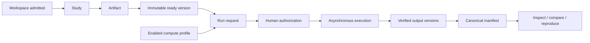
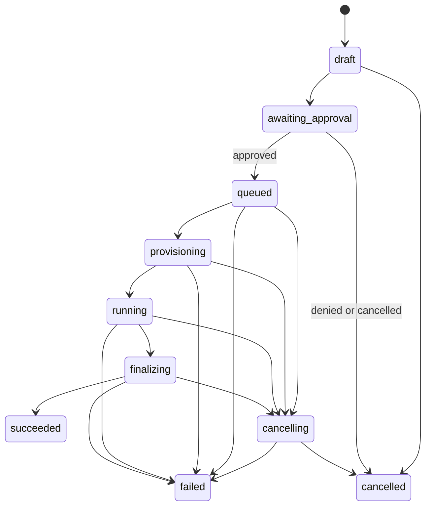

# Science Operations User Guide

**Audience:** non-technical users, laboratory or engineering operators,
workspace administrators, and entry-level programmers  
**Applies to:** the current Puppetmaster Science Operations local
control-plane and exact-source static-workflow slice

> [!IMPORTANT]
> Science Operations has a verified local control-plane and deterministic
> exact-source static workflow. It is **not a production scientific-compute
> release**, and the original MVP definition of done is **NOT MET**. The bundled
> provider does not execute user notebooks or OCI images. Jupyter Enterprise
> Gateway execution, live rootless OCI execution, trame remote rendering, OCCT
> tessellation, target TLS/load/HA/SLO/CVE/disaster-recovery proof, and named
> scientific-domain validation remain release gates.

> [!CAUTION]
> Use only data explicitly approved as `non_regulated`. Do not upload health,
> human-subject, export-controlled, defense, or regulated data, and never assume
> internal confidential data qualifies. A checksum proves
> byte identity; it does not prove that a model, mesh, solver, result, or
> scientific conclusion is correct.

## Contents

1. [What Science Operations does](#1-what-science-operations-does)
2. [The five ideas to understand first](#2-the-five-ideas-to-understand-first)
3. [Roles and permissions](#3-roles-and-permissions)
4. [Before you start](#4-before-you-start)
5. [Tour of the interface](#5-tour-of-the-interface)
6. [Your first end-to-end workflow](#6-your-first-end-to-end-workflow)
7. [Studies, artifacts, and immutable versions](#7-studies-artifacts-and-immutable-versions)
8. [Configure, approve, and monitor a run](#8-configure-approve-and-monitor-a-run)
9. [Read the manifest, reproduce, and compare](#9-read-the-manifest-reproduce-and-compare)
10. [Preview and visualize results](#10-preview-and-visualize-results)
11. [Workspace admission and revocation](#11-workspace-admission-and-revocation)
12. [Quotas, cleanup, and safe deletion](#12-quotas-cleanup-and-safe-deletion)
13. [Troubleshooting](#13-troubleshooting)
14. [Security and safe operating rules](#14-security-and-safe-operating-rules)
15. [Continuity, rollback, backup, and recovery](#15-continuity-rollback-backup-and-recovery)
16. [Beginner programmer guide](#16-beginner-programmer-guide)
17. [REST API quick reference](#17-rest-api-quick-reference)
18. [Glossary](#18-glossary)
19. [Checklists](#19-checklists)
20. [Related documentation](#20-related-documentation)

---

## 1. What Science Operations does

Science Operations organizes scientific work around a durable chain of
evidence:

1. A **study** is the workspace for one investigation.
2. An **artifact** names a logical input or output, such as a data set,
   notebook, geometry file, result, or log.
3. An **artifact version** is an immutable set of bytes with a SHA-256 digest.
4. A **compute profile** records an approved environment and resource ceiling.
5. A **run** links exact input versions to a requested computation.
6. A human **authorization** decides whether the queued work may proceed.
7. A successful run publishes immutable output versions and a canonical
   **provenance manifest**.
8. A user may inspect, compare, reproduce, or visualize the retained evidence.



The feature is a control plane. It records identity, state, approvals,
resource requests, output receipts, and provenance. It does not decide whether
your equations, boundary conditions, units, mesh, solver, or conclusions are
scientifically valid.

### What “succeeded” means

`succeeded` means the provider reported completion and Puppetmaster finished
output promotion, checksum verification, and manifest finalization. It does
not mean:

- the model is physically correct;
- the calculation converged;
- the mesh is suitable;
- the result is numerically equivalent to another run;
- the work is publication-ready; or
- the result can be reproduced on a different environment.

Those claims require named domain validation and retained evidence.

---

## 2. The five ideas to understand first

### 2.1 Enabled, admitted, and provider-approved are different gates

Three independent decisions must not be confused:

| Gate | Plain-language meaning | What it does **not** prove |
|---|---|---|
| Science enabled | The server exposes the Science subsystem. | That this workspace may create work. |
| Workspace admitted | An admin recorded that this workspace may cross new-resource boundaries. A missing admission record is denied. | That a compute or render provider is safe or production-ready. |
| Provider admitted | Operators have separately proved and approved the external provider contract. | Scientific validity of a particular run. |

Seeing `PILOT ADMITTED`, a configured URL, or a green readiness response does
not waive an external-provider release gate.

### 2.2 Versions are immutable

An artifact version is identified by its bytes, size, and SHA-256 digest. Do
not edit a historical version. Upload a new version and, when appropriate,
select the previous version as its parent.

### 2.3 Work is asynchronous and authorized

Submitting a run creates durable records and normally places the run in
`awaiting_approval`. Execution happens later. The authorization decision is in
the NEXUS `AUTHORIZATIONS` task, not inside the Science run dossier. Science
uses the full application stage, so the shell side panels are not shown while
the Science view is open.

### 2.4 REST is the durable truth

Live events make the display feel immediate, but the REST response is
authoritative. When the screen says `BUS DISCONNECTED`, displayed records may
be stale. Refresh before making a decision.

### 2.5 Provenance is not scientific validation

The manifest endpoint's top-level `complete=true` means the current structural
and relational assessment found the required provenance and no recorded gap.
The nested manifest and its SHA-256 remain immutable historical bytes, so a
current verdict may become incomplete without rewriting history. It does not
prove numerical equivalence, bitwise reproducibility, or scientific
correctness.

Human/domain review is stored separately as an append-only validation record.
Creating one does not edit either run manifest. Its reviewer ID and role come
from the signed-in session, not from request data.

---

## 3. Roles and permissions

Roles are hierarchical: **member < builder < admin < owner**. A higher role
inherits the permissions of the lower roles.

| Action | Member | Builder | Admin / Owner |
|---|:---:|:---:|:---:|
| View admission status, studies, artifacts, versions, profiles, runs, events, manifests, and content | Yes | Yes | Yes |
| Use client/static inspection tools | Yes | Yes | Yes |
| Create or change ordinary Science resources while admitted | No | Yes | Yes |
| Upload versions and submit runs while admitted | No | Yes | Yes |
| Approve or deny pending authorizations | No | Yes | Yes |
| Cancel a run or close a render session | No | Yes | Yes |
| Reproduce a run | No | Yes | Yes |
| Request a same-workspace run comparison | Yes | Yes | Yes |
| Read immutable domain/numerical validation records | Yes | Yes | Yes |
| Author an immutable validation record through the FUI or API | No | No | Yes |
| Review the redacted admin action queue | No | No | Yes |
| Change workspace pilot admission | No | No | Yes |
| Create or update compute profiles | No | No | Yes |
| Purge one exact, unreferenced version by checksum | No | No | Yes |

Comparison is a read: a member may use the FUI control or the member-readable
comparison GET for two same-workspace runs with manifests. Reproduction creates
a new run and still requires builder rights plus workspace admission.

Admins also see the paginated `ADMIN ACTION QUEUE`. It shows only bounded,
redacted reconciliation/cleanup reasons and typed navigation controls. It is not
provider-wide discovery. The fresh installed-browser Science gate covers the
released local journey; it does not add provider-wide orphan discovery.

Automation must use an accountable builder identity. Do not use a shared owner
account.

---

## 4. Before you start

Ask these questions before creating anything:

- Is the data definitely `non_regulated`?
- Is the correct workspace open?
- Does the admission instrument say `PILOT ADMITTED`?
- Is your role sufficient for the planned action?
- Has an admin created an enabled, provider-backed compute profile?
- Has that provider passed its separate operational admission gate?
- Are the input files final enough to become immutable versions?
- Do you know each input's semantic role, units, and relevant random seeds?
- Is the resource request within the profile ceiling?
- Who will review the authorization and the scientific result?

Do not continue if regulated data, secrets, an unproved provider, or unclear
ownership is involved.

If you do not yet have an account, workspace membership, or the expected role,
start with the repository's [complete getting-started guide](../GETTING-STARTED.md)
and [installation guide](../INSTALL.md). After sign-in, the application header
shows the workspace name and your signed-in role. Stop if either is not the one
you expected.

### 4.1 Member-only five-minute inspection path

A member can inspect retained evidence without creating or changing Science
resources:

1. Open **SCIENCE OPERATIONS** and verify the workspace name and member role in
   the application header.
2. Select the intended study, then select an artifact and an exact `ready`
   version. Check its version number, SHA-256, size, and media type.
3. In the `RUN` tab, select a `succeeded` run. Read its input/output references,
   recent events, and manifest hash. A member must not interpret `succeeded` as
   scientific correctness.
4. Open `MANIFEST`. Read the completeness verdict, every gap, declared
   limitations, exact lineage, environment snapshot, and the separate
   `DOMAIN VALIDATION LEDGER`.
5. If another manifested run is available on the current run page, use
   `COMPARE` and read each identity dimension separately. `NOT ASSESSED` means
   numerical equivalence has not been established.
6. Use `STRUCTURED TABLE`, `LOAD STATIC PREVIEW`, or the bounded client geometry
   diagnostic when appropriate. These member-readable previews do not create a
   render session. Starting a short-lived static render session requires
   builder rights.

If an expected study, version, run, manifest, or validation is missing, record
the visible ID and UTC time and ask the owning builder. Do not borrow a higher
privilege account or probe another workspace.

### 4.2 Safe checked-in practice data

This guide uses a non-regulated study named **Deterministic Fixture Tutorial**
with two checked-in files:

- data artifact `thermal-boundary.csv` from
  `services/science-runtime/fixtures/data/thermal-boundary.csv`;
- notebook artifact `deterministic-pilot.ipynb` from
  `services/science-runtime/fixtures/notebooks/deterministic-pilot.ipynb`;
- semantic roles `boundary_conditions` and `notebook`;
- explicit units and a seed in the parameters; and
- small development resource requests.

This example teaches the control-plane workflow. The bundled deterministic
provider may generate fixture outputs, but it does not execute the notebook.
Use these files only in a disposable local development workspace; they are test
corpus, not scientific evidence.

---

## 5. Tour of the interface

Open **SCIENCE OPERATIONS** from the main navigation or use a NEXUS jump such
as `STUDY DOSSIER`, `INGEST SCIENTIFIC ARTIFACT`, `CONFIGURE COMPUTATION`,
`OBSERVE SCIENTIFIC RUN`, `INSPECT PROVENANCE`, or `COMPUTE PROFILES`.

### 5.1 Connection and admission strip

At the top, the connection indicator shows one of:

- `BUS LIVE` — live display updates are connected;
- `REST RESYNC` — the interface is refreshing from durable state; or
- `BUS DISCONNECTED` — live updates are unavailable and records may be stale.

The admission instrument shows one of:

- `PILOT ADMITTED` — new resource-bearing actions may be attempted;
- `PILOT NOT ADMITTED` — new work is blocked;
- `PILOT ADMISSION CHECK` — a decision is being loaded; or
- `PILOT ADMISSION UNKNOWN` — the decision cannot be proved.

Check and unknown states fail closed: new-work controls remain unavailable.

`OP LOG //` displays the latest action or error. Treat it as a concise status
message, not as the complete audit trail.

### 5.2 Main layout

| Area | What it contains |
|---|---|
| Left rail | `01 // STUDIES` and `02 // ARTIFACTS`; create and ingest controls. |
| Center | `PRIMARY VIEWPORT //`, `IMMUTABLE VERSION CONTROL`, and admin compute-profile controls. |
| Right dossier | `RUN`, `CONFIGURE`, and `MANIFEST` tabs. |
| Stat row | Selected study/run, queue age, wall time, resources, and manifest state. |
| Bottom strip | `INGEST → PREPARE → AUTHORIZE → EXECUTE → VERIFY → RELEASE / RE-RUN`. |

Science occupies the full stage. To decide a pending authorization, leave the
Science view for NEXUS and open its `AUTHORIZATIONS` task, or press
**Ctrl+K**/**Command+K** and choose `TASK // AUTHORIZATIONS`.

### 5.3 Holding a control

Risk-bearing actions use a **hold button**. Press and keep holding until the
control completes. Releasing early cancels the action. Keyboard users can focus
the control and hold **Enter** or **Space**.

Study and artifact lists support **Up**, **Down**, **Home**, and **End**.
Dossier tabs support **Left**, **Right**, **Home**, and **End**.

---

## 6. Your first end-to-end workflow

### Step 1 — Admin: admit the workspace

1. Open **SCIENCE OPERATIONS**.
2. Confirm you are in the intended workspace.
3. In the admission control, enter a concrete administrative reason, for
   example: `Approved for non-regulated deterministic tutorial work`.
4. Hold `HOLD TO ENABLE PILOT`.
5. Confirm the instrument changes to `PILOT ADMITTED` and records an update
   time.

Admission is workspace-specific and audited. It is not a provider safety
certificate.

### Step 2 — Admin: create or select a compute profile

Open `COMPUTE PROFILE CONTROL · ADMIN`, select `NEW`, and enter:

- a clear profile name;
- the registered provider type;
- an immutable image digest in the form `sha256:` followed by 64 lowercase
  hexadecimal characters;
- the kernel name;
- CPU, memory, GPU, and wall-time ceilings;
- a non-empty dependency lock;
- whether the profile is enabled.

Then hold the create control. Resource fields are ceilings, not recommended
defaults.

The digest, kernel, and dependency lock are provenance claims. Obtain them from
the admitted provider/deployment record; never invent values merely to satisfy
the form. For the checked-in deterministic tutorial only, the retained browser
fixture uses these explicitly non-production values:

| Field | Deterministic tutorial value |
|---|---|
| Name | `Deterministic Fixture Tutorial — non-production` |
| Provider | `local_container` |
| Image digest | `sha256:1445edcf2ab7a2400b0851810d78bf572ad104afc8518f5cd207d88c528b72d6` |
| Kernel | `python-fixture-v1` |
| CPU / memory / GPU / wall ceiling | `1000` millicores / `512` MiB / `0` / `300` seconds |
| Dependency lock JSON | `{ "python": "fixture" }` |

Those values identify the deterministic contract fixture; they do not identify
an executable OCI image or prove provider safety. The current FUI accepts a
non-empty dependency-lock JSON object and does not expose a network-policy
field. The REST contract may set `network` to exactly `none`; that is an
API/operator option.

Do not select Jupyter Enterprise Gateway simply because it appears in a list.
JEG is currently NO-GO and no production adapter is registered. The bundled
local and HTTP fixtures do not execute user code.

### Step 3 — Builder: create a study

1. In `01 // STUDIES`, choose `+ CREATE STUDY`.
2. Enter `Deterministic Fixture Tutorial`.
3. Hold `HOLD TO CREATE`.
4. Select the new study.

The FUI creates a `non_regulated` study. Selecting another study resets the
artifact/run context and closes an active render session.

The backend also supports descriptions, renaming, irreversible archive, and a
workshop-project link, but the current FUI does not expose those edit controls.

### Step 4 — Builder: ingest the first artifact

1. Select the study.
2. Choose `⇪ INGEST ARTIFACT`.
3. Enter logical name `thermal-boundary.csv`.
4. Choose kind `DATASET` and format `csv`.
5. Select
   `services/science-runtime/fixtures/data/thermal-boundary.csv` from the
   repository checkout.
6. Hold `HOLD TO INGEST`.

The browser hashes the file before upload. The browser path refuses files over
256 MiB. This release does not document a supported self-service large-file
client. For a larger object, stop and ask the platform owner whether an approved
authenticated integration exists. Do not split, append, or improvise a signed
URL. Uploads are whole-file and restart-only—there is no multipart resume or
append.

The server also enforces an absolute whole-transfer deadline, an idle deadline
between received chunks, and a per-workspace external-stream cap shared across
server instances. If a deadline or capacity check rejects the transfer, do not
append or continue the old body. Refresh the version state; a timed-out
reservation is quarantined for safe cleanup, and uploading the file again
requires a new whole-file intent.

The shipped defaults are one hour total, one minute without a received chunk,
and four simultaneous external uploads per workspace. An operator may tighten
or relax those values within documented bounds, so the deployment's actual
limits may differ. These server limits do not enlarge the browser's 256 MiB
self-service limit.

Repeat the flow for
`services/science-runtime/fixtures/notebooks/deterministic-pilot.ipynb`, logical
name `deterministic-pilot.ipynb`, kind `NOTEBOOK`, format `ipynb`.

Wait for each version to become `ready`. Only ready versions can be run inputs.

### Step 5 — Builder: configure the run

1. Open the `CONFIGURE` tab.
2. Select an enabled compute profile.
3. Select the ready notebook and data versions.
4. Give them semantic roles `notebook` and `boundary_conditions`.
5. Enter a JSON object for parameters:

   ```json
   {
     "units": {
       "time": "s",
       "temperature": "K",
       "pressure": "Pa"
     },
     "randomSeeds": {
       "main": 7
     }
   }
   ```

6. Enter every resource field. The FUI takes CPU in cores and converts it to
   integer millicores; memory is whole MiB, GPU count is a whole number, and
   wall time is whole seconds.
7. Check that each request is at or below the profile ceiling.
8. Hold `HOLD TO SUBMIT COMPUTE`.

Submission is not immediate execution. It creates a durable run, mission,
immutable input links, and an authorization request.

### Step 6 — Builder or higher: decide the authorization

1. Open **NEXUS** from the main navigation, then open the `AUTHORIZATIONS`
   task. A faster path from Science is **Ctrl+K**/**Command+K**, followed by
   `TASK // AUTHORIZATIONS`; the application changes to NEXUS and opens the
   task pane.
2. Match the Science request to the study/run context, then inspect its prompt
   and evidence.
3. To approve, hold `HOLD TO AUTHORIZE`.
4. To reject, choose `DENY`.

Approval moves the run toward `queued` and atomically checks the workspace
active-run quota. Rejection changes it to `cancelled`.

### Step 7 — Monitor the run

Return to the Science `RUN` tab and select the run. The active dossier refreshes
about every three seconds; use `↻ REFRESH` when live events are disconnected.

Watch:

- state and execution generation;
- queue and start times;
- requested resources and profile snapshot;
- progress and bounded recent events;
- immutable input and output references;
- errors; and
- manifest hash when available.

Do not manually alter state, generation, handles, checksums, or manifest data.

### Step 8 — Cancel only when necessary

For an active run, hold `HOLD TO ABORT GEN n`. Cancellation is fenced to the
displayed generation. If the state changed, refresh and decide again.

A run may remain `cancelling` when the exact provider instance cannot prove a
terminal state. Do not clear the handle or force the database state. Preserve
the record and follow the operator runbook.

### Step 9 — Inspect outputs and the manifest

After a successful run:

1. Inspect output version SHA-256, size, type, and semantic role.
2. In the deterministic tutorial, confirm the PNG version metadata contains
   `fixturePreview=true` and `productionCompute=false`. The current FUI does not
   display those two keys; use the exact authenticated API check in
   [§16.11](#1611-inspect-the-exact-output-metadata-and-manifest), or ask an
   accountable builder/admin to perform it. If either label is absent or
   different, stop and ask an operator which provider produced it.
3. Open the `MANIFEST` tab.
4. Read `MANIFEST COMPLETE` or `MANIFEST INCOMPLETE`.
5. If incomplete, read every named gap.
6. Review the profile image digest, kernel, adapter version, parameters, units,
   seeds, approvals, validations, limitations, and input/output lineage.

Do not translate `MANIFEST COMPLETE` into “scientifically correct.”

### Step 10 — Compare or reproduce

To reproduce, start from a succeeded run with a complete manifest, then hold
`HOLD TO RE-RUN MANIFEST`. This creates a new run and authorization. It never
rewrites the source manifest. Profile-snapshot or adapter drift is refused.

To compare, select another succeeded run with a manifest and choose `COMPARE`.
The current FUI lists candidates only from the current paginated run page; page
through the run list if the candidate is absent, or use the REST API.
The result reports exact input, parameter, environment, and output identity as
separate facts. Numerical equivalence remains `NOT ASSESSED` unless a candidate
has an explicit append-only numerical-equivalence record linked to that exact
baseline. Both current manifest hashes and both output-checksum snapshots must
still match the record.

### Step 11 — Close temporary visualization resources

Unload a client geometry preview when finished. If a render session exists,
choose `CLOSE RENDER`. Closing remains available after workspace revocation.

### 6.12 What the built-in Science workflow automates today

The template catalog includes **Science: reproducible notebook run**. In the
released local path, it completes this fail-closed sequence:

1. Inspect the exact artifact and immutable ready version.
2. Request a provider quote. An unavailable quote stops the mission.
3. Show one bounded review record containing the checksum, quote, parameters,
   and resource request.
4. Submit exactly that reviewed record as an asynchronous Science run. A
   changed or uninspected input is refused.
5. Enter mission state `waiting` on that exact run. Migration 14 stores this
   wait durably, so a server restart does not require a guessed timer or a new
   submission.
6. Resume only after the run reaches a terminal database state. A failed or
   cancelled run fails the workflow. A succeeded run without a complete
   manifest also fails closed.
7. Select one bounded, ready, run-linked PNG and require a 64-character
   lowercase SHA-256. If the run has no eligible PNG, the mission stops before
   opening a render.
8. Show a second human approval that names the exact PNG source. This approval
   authorizes only static display; it does not authorize client, remote, or
   trame rendering.
9. Open that exact PNG with `mode="static"` and a stable idempotency key derived
   from the reviewed run key. A lost-response replay returns the same intent
   rather than allocating another session.
10. Read the final manifest and verify that the render source still matches the
    selected version/checksum.

The first authorization reviews the submission intent. Science submission also
creates its own normal run approval, which binds the immutable compute-profile
snapshot and image digest. The later render approval is separate because it
names the exact output that will become visible.

With the bundled deterministic provider, the selected PNG is data-derived but
is explicitly labelled `fixturePreview=true` and `productionCompute=false`.
This proves the workflow, approval, wait/recovery, checksum, replay, and display
path. It does not prove that a notebook ran or that the image is scientifically
valid.

If a mission stays `waiting`, do not approve it again, clone it, or invent a
delay. Check the target Science run. The mission resumes through its durable
wait after terminal state; an expired continuation claim is recovered by
startup/periodic recovery. Cancelling the parent workflow cancels only its wait,
not the independent Science run.

For entry-level programmers, action arguments may refer to an earlier completed
step with an exact placeholder such as
`{{steps.review_evidence.resourceRequest}}`. The referenced JSON value keeps its
type, so an object remains an object rather than becoming text. Only letters,
numbers, underscores, and hyphens are accepted in the step ID. Missing steps or
properties stop the workflow instead of silently submitting different data.

---

## 7. Studies, artifacts, and immutable versions

### 7.1 Study lifecycle

A study is either `active` or `archived`. Archive is irreversible in the
current contract. An archived study cannot accept a new run and cannot be
reactivated.

### 7.2 Artifact kinds

| Kind | Typical use |
|---|---|
| `dataset` | CSV, JSON, HDF5, or other input data. |
| `notebook` | Notebook source captured as an immutable input. |
| `geometry` | VTK, STL, STEP, or other geometry/CAD-related content. |
| `result` | Numerical or derived output. |
| `log` | Retained textual output or diagnostic log. |
| `manifest` | A manifest treated as an artifact. |
| `environment` | Dependency or environment description. |
| `other` | Content that does not fit the named categories. |

`format` is a short descriptive value such as `csv`, `ipynb`, `vtk`, or
`json`. Media type is recorded on the version during completion.

### 7.3 Version states

| State | Meaning | Can be a run input? |
|---|---|:---:|
| `pending` | A reserved version exists, but final byte promotion is not complete. | No |
| `ready` | Bytes and checksum were finalized. | Yes |
| `quarantined` | Validation, checksum, or format processing failed. | No |
| `expired` | Content was retired; the immutable tombstone remains. | No |

### 7.4 Uploading a new version

Open `IMMUTABLE VERSION CONTROL · <artifact>`, select a ready parent if the new
file derives from it, choose the new file, and hold `HOLD TO UPLOAD VERSION`.

The parent link records lineage; it does not imply scientific equivalence.

### 7.5 Download behavior

The current FUI does not provide a general-purpose download button. It fetches
content only for explicit static image and client geometry previews. The REST
API supports authenticated content reads and one byte range.

---

## 8. Configure, approve, and monitor a run

### 8.1 Run lifecycle



| State | What a beginner should understand |
|---|---|
| `draft` | Durable run preparation exists. |
| `awaiting_approval` | A human decision is pending. |
| `queued` | Approved and waiting for a worker/provider turn. |
| `provisioning` | The execution environment is being prepared. |
| `running` | The admitted provider reports active execution. |
| `finalizing` | Outputs, checksums, links, and manifest are being finalized. |
| `cancelling` | Cancellation was requested but terminal proof is pending. |
| `succeeded` | Provider completion plus output and manifest finalization completed. |
| `failed` | The run ended unsuccessfully; inspect error/events. |
| `cancelled` | Terminal cancellation was proved. |

### 8.2 Inputs and semantic roles

A run needs 1–200 ready versions from the same study. Each input has a short,
meaningful semantic role. Prefer `notebook`, `loads`, `mesh`, `boundary_conditions`,
or another domain label over generic names such as `file1`.

### 8.3 Parameters, units, and seeds

Parameters must be a JSON object. Record units and random seeds explicitly.
Do not rely on a filename or a comment inside a notebook to provide the only
record of these facts.

Never put passwords, access keys, bearer tokens, private keys, session keys, or
other credentials in parameters.

### 8.4 Resource requests

| Field | Unit | Rule |
|---|---|---|
| CPU | millicores in the API; cores in the FUI | Positive; at or below profile ceiling. |
| Memory | MiB | Positive whole number; at or below ceiling. |
| GPU | count | Whole number; zero is allowed. |
| Wall time | seconds | Positive whole number; at or below ceiling. |

An estimate marked `N/A` means unknown, not free and not zero. A provider quote
with source `declared` is configuration, not a measured capacity or cost.

### 8.5 Idempotency

Every submission has an idempotency key. If a response is lost, retry the same
intent with the **same** key. Do not create a new key to “make it work”; that can
create a second run. Reusing the key with changed profile, inputs, resources, or
parameters returns a conflict.

---

## 9. Read the manifest, reproduce, and compare

### 9.1 What the manifest records

The canonical manifest can include:

- exact input and output version IDs, hashes, sizes, and semantic roles;
- compute profile, immutable image digest, kernel, resource request, and
  adapter version;
- dependency lock plus a linked immutable `ready` notebook whose bytes parsed
  as `ipynb` under the `code`, `notebook`, or `solver` role;
- canonical parameters, units, seeds, and environment facts;
- actor, approvals, policies, tool calls, and timestamps;
- state history, validations, and explicit limitations; and
- a SHA-256 hash of the canonical manifest.

### 9.2 Completeness and gaps

If required provenance is missing, the manifest is incomplete and names its
gaps. Fixing a gap means creating new evidence or a new run—not editing the
historical manifest.

Read the endpoint/FUI's top-level completeness and gaps as the current verdict.
The nested manifest is the exact historical record protected by its displayed
SHA-256. A raw `parameters.sourceRevision` is only a user note: the platform
does not fetch a version-control system to verify it, the manifest's verified
top-level `sourceRevision` stays `null`, and it cannot replace the parsed
notebook input.

### 9.3 Comparison dimensions

The comparison result keeps these dimensions separate:

- exact input identity;
- exact canonical parameters;
- exact environment/profile facts;
- exact output identity; and
- numerical equivalence evidence.

Matching hashes prove the exact bytes match. Different hashes do not by
themselves say whether results are scientifically equivalent. Numerical
equivalence is unknown unless a named metric and tolerance are recorded.

### 9.4 Read the immutable validation ledger (all members)

Select a run and open its `MANIFEST` tab. The `DOMAIN VALIDATION LEDGER` is
separate from the canonical manifest and is readable by every workspace
member.

1. Use `PREVIOUS RECORDS` and `NEXT RECORDS` to move through bounded pages.
2. Select a retained revision. The detail panel shows the decision, metric,
   observed value, tolerance, units, method/protocol, reviewer, creation time,
   mandatory limitations/reason, candidate and baseline identities, exact
   manifest hashes, record hash, and bound output checksums.
3. Treat `PASS` as a named human decision for only the recorded evidence and
   limitations. It is not a general claim that the model, software, or platform
   is correct.

The summary list deliberately omits the potentially large checksum arrays; the
selected detail fetch returns them. If the list is empty, scientific validation
has not been established for that run.

### 9.5 Append a review in the FUI (admin/owner)

An admin or owner can expand `APPEND DOMAIN REVIEW · ADMIN / OWNER` below the
ledger. The selected candidate must be succeeded, have an intact manifest, and
contain at least one manifested output.

1. Choose `STANDALONE DOMAIN VALIDATION` when the decision applies only to the
   selected candidate. This mode deliberately has no baseline and makes no
   numerical-equivalence claim.
2. Choose `LINKED NUMERICAL EQUIVALENCE` only when comparing the candidate with
   a distinct succeeded baseline. Choose that baseline from the eligible runs
   on the current run page. If the required baseline is not offered, do not
   substitute another run; use the authenticated API or return after arranging
   a bounded page containing the exact pair.
3. Enter the approved metric, a finite nonnegative tolerance, the finite
   observed value, units, and the exact method or protocol identifier.
4. Choose `PASS` or `FAIL` and write a nonempty limitations/reason statement.
   State the tested range and exclusions; a bare “looks correct” is not usable
   scientific evidence.
5. Hold `HOLD TO APPEND REVIEW` until the confirmation completes. Releasing
   early cancels the action. The success announcement names the immutable
   revision and record hash prefix.

There is intentionally no reviewer field: reviewer ID and role come from the
signed-in session. There are also no edit or delete controls. If a decision is
wrong, append a corrected revision and explain why. Workspace pilot revocation
does not block this metadata review, but a global read-only policy still fails
closed and its server error is shown.

Never invent scientific values. Automated browser values and documentation
examples are labelled **synthetic/non-release** and cannot satisfy a named
domain review or release sign-off.

### 9.6 Append a review through the API (entry-level programmer)

Use the API when the exact baseline is not on the current FUI page or when an
approved integration records the review. For a standalone domain review, POST
to `/api/science/runs/:candidateRunId/validations` without `baselineRunId` and
use `kind: "domain-validation"`. For a numerical-equivalence decision, use
`kind: "numerical-equivalence"` and include the distinct succeeded baseline run
ID.

**Synthetic/non-release API example — never use these fabricated values as
scientific evidence:**

```json
{
  "kind": "numerical-equivalence",
  "baselineRunId": "00000000-0000-4000-8000-000000000001",
  "metric": "relative-L2 pressure error",
  "tolerance": 0.000001,
  "observedValue": 0.00000042,
  "units": "dimensionless",
  "methodProtocolId": "synthetic-non-release-protocol/v1",
  "decision": true,
  "limitationsReason": "Validated only for the declared steady-state inlet range."
}
```

Do not send `reviewerId`, `reviewerRole`, `createdAt`, manifest hashes, output
checksums, or `recordHash`. The server derives those fields from the session
and the immutable succeeded runs. Extra fields are rejected.

After creation, whether through the FUI or API:

1. Read `GET /api/science/runs/:candidateRunId/validations` and retain the
   returned positive `revision`, record ID, and SHA-256 `recordHash`. The list
   is capped at 100 summaries and deliberately omits output-checksum arrays.
2. Read the checksum-bound detail at
   `GET /api/science/runs/:candidateRunId/validations/:validationId`. Confirm
   the reviewer ID is the signed-in admin/owner and the protocol ID,
   limitations, manifest hashes, and checksum snapshots are correct.
3. Run the comparison with the exact baseline. The system follows one
   database-maintained head for that candidate, review kind, and baseline. The
   decision is used only while the head anchor, exact pointed record ID and
   revision, record self-hash, both manifest hashes, and output-checksum
   snapshots still match. If any selector, pointer, or hash is inconsistent,
   the result becomes unknown; the system does not search an older review for
   a more favorable answer. `createdAt` is database-assigned display
   information and never decides which correction wins.
4. If the review is wrong, do not edit or delete it. Append a new review with a
   corrected decision and an explicit reason; history remains visible. If the
   newest revision is damaged or mislinked, comparison reports numerical
   evidence as unavailable instead of falling back to an older decision.

---

## 10. Preview and visualize results

The viewport provides bounded inspection, not a full scientific visualization
workstation.

### 10.1 Structured table

`STRUCTURED TABLE` is the universal fallback. It is appropriate when WebGL,
parsing, static preview, or remote rendering is unavailable.

### 10.2 Static image

For PNG, JPEG, GIF, or WebP, choose `LOAD STATIC PREVIEW`. Content is not loaded
automatically. Other media types, including SVG, are forced to download with a
sandbox policy and may not preview.

### 10.3 Client geometry diagnostic

For geometry or VTK/STL/STEP/STP formats, choose
`LOAD GEOMETRY · MAX 8.0 MiB`.

The bounded worker accepts a limited diagnostic subset:

- legacy ASCII VTK wire topology;
- ASCII STL wire facets; and
- STEP raw points and `EDGE_CURVE` endpoints.

It is limited to 8 MiB, about 15 seconds of parser work, 5,000 points, and
10,000 edges. Binary, oversized, malformed, or invalid UTF-8 content is
refused. STEP output is a wire diagnostic—not CAD tessellation, a valid
analysis mesh, or proof of geometry fidelity.

Palette and ISO/XY/XZ/YZ projection controls apply only to the client geometry
diagnostic. The legend is metadata-driven, not derived from rendered pixels.

### 10.4 Render sessions

The released session workflow is a short-lived static PNG view. Choose one
exact ready PNG output no larger than **8 MiB (8,388,608 bytes)** from the
selected run, then hold `HOLD TO START RENDER`. The selector shows the immutable
name, size, and checksum; the image, caption, legend, and metadata remain bound
to that same stored source. If no eligible PNG exists, the control refuses the
request. JSON, VTK, STEP, oversized PNG, client, and remote requests are not
silently converted to static.

A retry after a network error reuses the same request key, so a lost response
cannot allocate another session. Close keeps the session visible until the
server confirms the idempotent delete. A successful close releases quota and
artifact retention while keeping a short replay tombstone. Close and an exact
already-created replay remain available after workspace revocation; genuinely
new sessions remain blocked.

trame remote rendering remains **NO-GO**. The FUI does not offer a remote-mode
selector, and a configured HTTP adapter is not production admission.

---

## 11. Workspace admission and revocation

### 11.1 Admission is default-deny

An absent persisted admission row means denied. Members can read the redacted
decision (`workspaceId`, `admitted`, and `updatedAt`). Admins and owners can
change it only with a non-empty reason.

Another open browser can display an old decision until its next refresh (up to
about 30 seconds), but the backend checks authoritative database state at a
new-work boundary. Unknown UI state fails closed.

### 11.2 What revocation blocks

Revocation blocks new resource-bearing actions such as:

- creating studies, artifacts, or upload intents;
- creating or changing compute profiles;
- submitting or reproducing runs;
- approving work into execution;
- starting or renewing render sessions; and
- creating other new Science resources.

### 11.3 What revocation preserves

Revocation is **not** a force-kill. It preserves convergence and evidence:

- reads, content inspection, manifests, and comparisons;
- rejection of a pending authorization;
- exact-generation run cancellation;
- render-session close;
- transfer and completion of an already accepted upload;
- exact-checksum purge;
- run ticks and reconciliation; and
- retention cleanup.

A request that crossed its admission boundary just before a racing revoke may
finish. If immediate hard-kill semantics are required, the current admission
contract is insufficient.

---

## 12. Quotas, cleanup, and safe deletion

### 12.1 Quotas are conservative

The subsystem can enforce workspace limits for active runs, stored bytes,
object size, and render sessions. Storage accounting includes retained artifact
versions and active or failed reservations that may still own bytes. Provider
output space is reserved before streaming.

If cleanup cannot prove that exact bytes were removed, metadata and quota stay
charged. This is intentional: availability must not win over evidence or byte
accounting.

Rate limiting is per process by default. A production deployment still needs a
deployment-wide reverse-proxy policy.

### 12.2 Admin purge

To purge one version:

1. Confirm it is the exact ready version you intend to retire.
2. Close any active FUI render.
3. Copy the complete lowercase SHA-256 digest.
4. Type it into the confirmation field.
5. Hold `HOLD TO PURGE EXACT VERSION`.

Purge is allowed only for an unreferenced ready version. A run link, child
version, any render-session row, or active finalization holds the content. The
store removes bytes before quota is released, and an immutable `expired`
tombstone remains so version ordinals and history are not reused.

This narrow purge is not a general legal-hold or retention-policy system.

### 12.3 Never perform broad cleanup by hand

Do not:

- delete quarantine content by directory age;
- append to a partial upload;
- mark quarantined content ready;
- clear provider or renderer handles;
- manually decrement quota; or
- delete rows to hide a stuck state.

Transfer and finalization leases prevent cleanup from racing active work.
Failures are retained and retried with backoff.

---

## 13. Troubleshooting

| Symptom | Likely meaning | Safe response |
|---|---|---|
| `PILOT NOT ADMITTED` | Workspace is revoked or was never admitted. | Ask an admin for a reasoned decision. Existing reads and convergence actions remain. |
| `PILOT ADMISSION CHECK/UNKNOWN` | Decision cannot yet be proved. | Wait or refresh; do not bypass the fail-closed control. |
| `BUS DISCONNECTED` | Live display updates are unavailable. | Use `↻ REFRESH`; treat REST state as authoritative. |
| “Your role cannot perform…” / 403 | Your role is below the required level. | Ask a builder or admin; do not borrow an account. |
| No enabled profile | No usable profile is configured. | Ask an admin to configure a registered, separately admitted provider. |
| File exceeds browser hash limit | Browser path is over 256 MiB. | Stop. This release has no documented self-service large-file client. Ask the platform owner whether an approved authenticated integration exists; do not split or append the object. |
| Version remains `pending` | Upload or promotion has not finished. | Wait, refresh, and inspect the operation log; do not use it as input. |
| Version is `quarantined` | Checksum/format/finalization failed. | Preserve it for diagnosis; do not flip it to ready. |
| Run remains `awaiting_approval` | Human decision is pending. | Open the NEXUS `AUTHORIZATIONS` task, directly or through **Ctrl+K**/**Command+K** -> `TASK // AUTHORIZATIONS`. |
| Approval returns conflict | State, quota, or admission changed. | Refresh the run and admission decision; decide from current state. |
| Run remains `queued` | Scheduler/provider turn is pending. | Check authenticated readiness and operator diagnostics; do not create a duplicate key. |
| Run remains `cancelling` | Provider terminal proof is missing. | Preserve generation and handle; follow the operator runbook. |
| Manifest is missing during an active run | Finalization has not completed. | Wait. This is normal before terminal success. |
| Manifest is missing after `succeeded` | Provenance finalization is inconsistent. | Escalate; do not manufacture a manifest. |
| HTTP 409 | Lifecycle, checksum, quota, reference, or generation conflict. | Refresh and read the returned error; do not blindly retry. |
| HTTP 429 | Rate limit reached. | Wait for `Retry-After`; reduce polling or batch work. |
| HTTP 503 | Disabled, read-only, unadmitted, or required dependency unavailable. | Inspect admission and authenticated readiness; do not bypass. |
| Static preview fails | Media type is unsupported or content fetch failed. | Retry once, then use structured table/download via API. |
| Geometry preview fails | Binary, malformed, too large, or unsupported topology. | Use structured table or an admitted external tool; do not claim parser coverage. |
| Render session expires/fails | Short-lived render could not continue. | Close it and use the table fallback. Trame remains NO-GO. |
| Purge conflicts | Provenance/child/render/finalization hold exists. | Inspect references and close only legitimate live resources; never delete evidence links. |

Current UI caveat: some entity-specific 404 responses can be shown as “Science
service is not installed.” Before diagnosing installation, refresh and confirm
that the requested entity or manifest actually exists.

---

## 14. Security and safe operating rules

### 14.1 Allowed data

Only `non_regulated` data is allowed. The current subsystem has no complete
consent, external-collaborator ACL, legal-hold, malware-scanning, sanitization,
or regulated-data control set.

### 14.2 Secrets

Secrets belong in the approved secret-management system. Never place them in:

- compute-profile config;
- run parameters;
- artifact metadata;
- mission or workflow literals;
- filenames or semantic roles;
- support tickets or chat; or
- logs and screenshots.

Never log upload tokens, signed URLs, query strings containing signatures,
provider handles, storage keys, bearer tokens, database credentials, or host
paths. Signed URLs can be replayed until they expire.

### 14.3 Untrusted boundaries

Treat browsers, artifacts, compute providers, renderers, and MCP clients as
untrusted. They must not receive database credentials, object-store keys,
provider control handles, signing secrets, or host filesystem paths.

### 14.4 Historical evidence

Never rewrite:

- an artifact checksum;
- a version number or parent link;
- a run generation or state;
- a manifest or manifest hash;
- an approval decision; or
- an audit actor/reason.

Create a new version or run instead.

---

## 15. Continuity, rollback, backup, and recovery

This section is an orientation. Operators must follow the detailed
[operator runbook](./operator-runbook.md) and
[rollout/rollback guide](./rollout-and-rollback.md).

### 15.1 Choose the smallest safe control

| Situation | Control |
|---|---|
| One workspace is unsafe or out of scope | Record a reason and revoke that workspace. |
| Broad incident after Science data exists | Set global Science read-only mode and restart all instances. |
| Emergency after provider work is stopped and render sessions are closed | Disable the Science subsystem only as the last resort. |

Read-only mode preserves reads, cancellation, render close, accepted-upload
completion, purge, and reconciliation. Full disable also removes those useful
controls and is not provider cleanup.

Never drop or downgrade migrations, rewrite manifests, or delete immutable
objects as a rollback shortcut.

### 15.2 Health and readiness

- `/api/health` is cheap process liveness.
- `/api/readyz` is a public, detail-free readiness result and returns 503 when
  required dependencies fail.
- `/api/readiness` is an authenticated, roughly five-second cached dependency
  snapshot.

The database always gates Science readiness. Storage and queue gate when
Science is enabled; compute gates when submission is enabled; render is
reported but does not currently gate general readiness. Readiness does not
prove workload capacity or provider admission.

### 15.3 Coordinated backup

A recoverable point includes:

- the database;
- the exact immutable objects;
- relevant in-flight quarantine when included by policy;
- provider idempotency/ledger receipts;
- configuration and allowlists; and
- secret **versions**, not secret values in documentation.

Redis persistence supports queue durability but is not a backup.

The retained loopback evidence includes a complete PostgreSQL migration 1-16
lifecycle, a Redis sentinel surviving `WAITAOF` and process restart, and a live
MinIO/S3 adapter lane. Those are component checks, not a coordinated recovery
point or target disaster-recovery drill.

Restore into isolation with egress and submissions disabled. Verify migrations,
object size/SHA-256, manifest hashes, and exact provider generations. Start
read-only and re-admit workspaces individually with reasons. Do not bulk-admit.

Target PostgreSQL/S3 restore drills and accepted RPO/RTO evidence are still
missing, so production recovery is not certified.

---

## 16. Beginner programmer guide

This chapter assumes basic JSON but no prior Puppetmaster knowledge. It uses
plain JavaScript in a disposable local development workspace so authentication
stays in the normal same-origin browser session.

Run the examples this way:

1. Start the local development application and sign in with an accountable
   owner/admin account for the admission/profile steps. A builder account is
   sufficient after those administrative steps are complete.
2. Open the local Puppetmaster origin, sign in, and verify the workspace.
3. Open the browser developer tools **Console** on that same origin.
4. Paste each JavaScript block in this chapter in order and keep the tab open.
   The examples store non-secret tutorial IDs under
   `globalThis.scienceTutorial` and stable idempotency keys in `localStorage`.

These examples are for the checked-in deterministic fixtures only. Do not paste
unreviewed code into a browser session, and do not use a production session for
this tutorial.

### 16.1 Authentication model

Science routes use the normal workspace session. The browser receives an
HttpOnly, SameSite `pm_session` cookie through the supported login flow. A
same-origin `fetch` is the intended model; JavaScript cannot and should not read
the cookie value.

The current local cookie is HttpOnly and SameSite=Lax. Production TLS and
Secure-cookie hardening remain deployment responsibilities. Never paste a
session cookie into source code, documentation, chat, or shell history.

Except for a fully signed artifact capability URL, every Science route requires
authentication and workspace membership. Foreign-workspace IDs are generally
returned as 404 to avoid revealing their existence.

### 16.2 Install the plain-JavaScript helpers

```js
globalThis.scienceTutorial ??= {};
var tutorial = globalThis.scienceTutorial;

function sleep(ms) {
  return new Promise((resolve) => setTimeout(resolve, ms));
}

function retryAfterMilliseconds(value, fallbackMs = 3_000) {
  if (!value) return fallbackMs;
  const seconds = Number(value);
  if (Number.isFinite(seconds) && seconds >= 0) {
    return Math.min(60_000, Math.max(1_000, seconds * 1_000));
  }
  const date = Date.parse(value);
  return Number.isFinite(date)
    ? Math.min(60_000, Math.max(1_000, date - Date.now()))
    : fallbackMs;
}

async function scienceRequest(path, init = {}) {
  const headers = new Headers(init.headers);
  if (typeof init.body === "string") {
    headers.set("content-type", "application/json");
  }

  const response = await fetch(path, {
    ...init,
    headers,
    credentials: "same-origin",
  });

  if (!response.ok) {
    const problem = await response.json().catch(() => ({}));
    const issues = Array.isArray(problem.issues)
      ? ` (${problem.issues.map((issue) => `${issue.path}: ${issue.message}`).join("; ")})`
      : "";
    const error = new Error(
      `${response.status}: ${problem.error ?? response.statusText}${issues}`,
    );
    error.status = response.status;
    error.retryAfter = response.headers.get("retry-after");
    throw error;
  }

  return response.json();
}

async function sha256Text(value) {
  const bytes = new TextEncoder().encode(value);
  const digest = await crypto.subtle.digest("SHA-256", bytes);
  return Array.from(new Uint8Array(digest), (byte) =>
    byte.toString(16).padStart(2, "0"),
  ).join("");
}
```

Do not use this JSON helper for artifact content or raw upload bodies.

The repository already provides a typed client in
`apps/web/src/api.ts`. Prefer it inside the web application rather than
duplicating route strings.

### 16.3 Check workspace admission

```js
var admissionResult = await scienceRequest("/api/science/workspace-admission");
tutorial.admission = admissionResult.admission;
console.log(tutorial.admission);
if (!tutorial.admission.admitted) {
  throw new Error("This workspace is not admitted; an admin must record the decision first.");
}
```

An admin can change it with a strict body:

```js
await scienceRequest("/api/science/workspace-admission", {
  method: "PATCH",
  body: JSON.stringify({
    admitted: true,
    reason: "Approved for non-regulated deterministic tutorial work",
  }),
});
```

The public response intentionally omits the row ID and updater identity.

### 16.4 Create a study

```js
var studyResult = await scienceRequest("/api/science/studies", {
  method: "POST",
  body: JSON.stringify({
    name: "Deterministic Fixture Tutorial",
    description: "Non-regulated deterministic control-plane exercise",
    classification: "non_regulated",
  }),
});
tutorial.study = studyResult.study;
console.log("Study", tutorial.study.id, tutorial.study.name);
```

Study names are 1–200 characters; descriptions are at most 20,000. Archive is
irreversible.

Study creation is not idempotent. If the response is lost, list studies and
find the exact created record before attempting another POST.

### 16.5 Create the data and notebook artifacts

```js
async function createTutorialArtifact(logicalName, kind, format) {
  const result = await scienceRequest(
    `/api/science/studies/${encodeURIComponent(tutorial.study.id)}/artifacts`,
    {
    method: "POST",
      body: JSON.stringify({ logicalName, kind, format }),
    },
  );
  return result.artifact;
}

tutorial.dataArtifact = await createTutorialArtifact(
  "thermal-boundary.csv",
  "dataset",
  "csv",
);
tutorial.notebookArtifact = await createTutorialArtifact(
  "deterministic-pilot.ipynb",
  "notebook",
  "ipynb",
);

console.log({
  dataArtifactId: tutorial.dataArtifact.id,
  notebookArtifactId: tutorial.notebookArtifact.id,
});
```

Artifact creation is also non-idempotent. On an ambiguous response, list the
study's artifacts and reconcile by ID and logical name before retrying.

### 16.6 Pick, hash, and upload both checked-in files

The example below creates its own temporary file picker; it does not depend on
an element in the Puppetmaster DOM. Run it once, then choose the named file from
the repository checkout when each picker opens.

```js
function chooseLocalFile(expectedName) {
  return new Promise((resolve, reject) => {
    const input = document.createElement("input");
    input.type = "file";
    input.hidden = true;
    input.addEventListener("change", () => {
      const file = input.files?.[0];
      input.remove();
      if (!file) return reject(new Error("No file was selected."));
      if (file.name !== expectedName) {
        return reject(new Error(`Expected ${expectedName}, received ${file.name}.`));
      }
      resolve(file);
    }, { once: true });
    document.body.append(input);
    input.click();
  });
}

async function sha256File(file) {
  const browserHashLimitBytes = 256 * 1024 * 1024;
  if (file.size > browserHashLimitBytes) {
    throw new Error(
      "This tutorial supports files up to 256 MiB. Stop and use only an approved large-file integration.",
    );
  }
  const digest = await crypto.subtle.digest("SHA-256", await file.arrayBuffer());
  return Array.from(new Uint8Array(digest), (byte) =>
    byte.toString(16).padStart(2, "0"),
  ).join("");
}

async function uploadTutorialFile(artifactId, file, mediaType) {
  const expectedSha256 = await sha256File(file);
  const intent = await scienceRequest(
    `/api/science/artifacts/${encodeURIComponent(artifactId)}/uploads`,
    {
      method: "POST",
      body: JSON.stringify({
        expectedSizeBytes: file.size,
        expectedSha256,
        filename: file.name,
        mediaType,
      }),
    },
  );

  // The token and URL are short-lived capabilities. Never print or persist them.
  const uploadTarget = intent.uploadUrl ??
    `/api/science/uploads/${encodeURIComponent(intent.uploadToken)}`;
  const uploadResponse = await fetch(uploadTarget, {
    method: "PUT",
    headers: { "content-type": "application/octet-stream" },
    body: file,
    credentials: "same-origin",
  });
  if (!uploadResponse.ok) {
    throw new Error(`Upload failed: ${uploadResponse.status}`);
  }

  const version = await scienceRequest(
    `/api/science/uploads/${encodeURIComponent(intent.uploadToken)}/complete`,
    {
      method: "POST",
      body: JSON.stringify({
        mediaType,
        metadata: { filename: file.name },
      }),
    },
  );
  if (version.status !== "ready" || version.sha256 !== expectedSha256) {
    throw new Error(`Version did not finalize as the expected ready bytes: ${version.status}`);
  }
  return version;
}
```

Choose `services/science-runtime/fixtures/data/thermal-boundary.csv` first:

```js
var dataFile = await chooseLocalFile("thermal-boundary.csv");
tutorial.dataVersion = await uploadTutorialFile(
  tutorial.dataArtifact.id,
  dataFile,
  "text/csv",
);
console.log("Ready data version", tutorial.dataVersion.id);
```

Then choose
`services/science-runtime/fixtures/notebooks/deterministic-pilot.ipynb`:

```js
var notebookFile = await chooseLocalFile("deterministic-pilot.ipynb");
tutorial.notebookVersion = await uploadTutorialFile(
  tutorial.notebookArtifact.id,
  notebookFile,
  "application/x-ipynb+json",
);
console.log("Ready notebook version", tutorial.notebookVersion.id);
```

The completion response is the public version object directly, not
`{artifactVersion: ...}`. Uploads are whole-file and restart-only. Completion is
safe to retry after an ambiguous completion response; do not blindly repeat a
claimed PUT, append bytes, or create a second intent before checking completion.

This release does not document a supported self-service upload client for files
over 256 MiB. Do not treat the server's streaming implementation as an
authorization to improvise CLI session handling or signed URLs.

### 16.7 Select the exact approved profile and validate its ceilings

List enabled profiles, then paste the exact UUID supplied by the administrator
who created the deterministic tutorial profile. Do not select “the first
enabled profile.”

```js
var profilePage = await scienceRequest(
  "/api/science/compute-profiles?enabled=true&limit=200",
);
console.table(profilePage.items.map((profile) => ({
  id: profile.id,
  name: profile.name,
  provider: profile.providerKind,
  imageDigest: profile.imageDigest,
  kernel: profile.kernelName,
  cpuMillicores: profile.resourceBounds.cpuMillicores,
  memoryMb: profile.resourceBounds.memoryMb,
  gpuCount: profile.resourceBounds.gpuCount,
  wallTimeSeconds: profile.resourceBounds.wallTimeSeconds,
})));

var approvedProfileId = prompt(
  "Paste the exact deterministic tutorial compute-profile UUID supplied by the admin:",
)?.trim();
if (!approvedProfileId) throw new Error("An exact approved profile ID is required.");

tutorial.profile = profilePage.items.find(
  (profile) => profile.id === approvedProfileId,
);
if (!tutorial.profile?.enabled) {
  throw new Error("The exact approved profile is absent or disabled.");
}

var expectedFixtureDigest =
  "sha256:1445edcf2ab7a2400b0851810d78bf572ad104afc8518f5cd207d88c528b72d6";
if (
  tutorial.profile.providerKind !== "local_container" ||
  tutorial.profile.imageDigest !== expectedFixtureDigest ||
  tutorial.profile.kernelName !== "python-fixture-v1" ||
  tutorial.profile.config?.dependencyLock?.python !== "fixture"
) {
  throw new Error("The selected profile does not match the documented deterministic fixture identity.");
}

tutorial.resourceRequest = {
  cpuMillicores: 500,
  memoryMb: 256,
  gpuCount: 0,
  wallTimeSeconds: 60,
};
for (const [field, requested] of Object.entries(tutorial.resourceRequest)) {
  const ceiling = tutorial.profile.resourceBounds[field];
  if (!Number.isInteger(ceiling) || requested > ceiling) {
    throw new Error(`${field} request ${requested} exceeds profile ceiling ${ceiling}.`);
  }
}
console.log("Approved profile and resource request verified", tutorial.profile.id);
```

### 16.8 Submit an idempotent run with both inputs

The example fingerprints the exact request intent and stores one random
idempotency key under that fingerprint before POST. Re-running the same block
after an ambiguous response therefore reuses the same key. Changing the
profile, resources, inputs, roles, or parameters produces a deliberate new
intent and a different stored key.

```js
tutorial.runIntent = {
  computeProfileId: tutorial.profile.id,
  resourceRequest: tutorial.resourceRequest,
  inputs: [
    {
      artifactVersionId: tutorial.notebookVersion.id,
      semanticRole: "notebook",
    },
    {
      artifactVersionId: tutorial.dataVersion.id,
      semanticRole: "boundary_conditions",
    },
  ],
  parameters: {
    units: { time: "s", temperature: "K", pressure: "Pa" },
    randomSeeds: { main: 7 },
  },
};

var runIntentHash = await sha256Text(JSON.stringify(tutorial.runIntent));
var runKeyStorageName = `science-tutorial:run-key:${runIntentHash}`;
var idempotencyKey = localStorage.getItem(runKeyStorageName);
if (!idempotencyKey) {
  idempotencyKey = crypto.randomUUID();
  localStorage.setItem(runKeyStorageName, idempotencyKey);
}
tutorial.runIdempotencyKey = idempotencyKey;

tutorial.submission = await scienceRequest(
  `/api/science/studies/${encodeURIComponent(tutorial.study.id)}/runs`,
  {
    method: "POST",
    body: JSON.stringify({
      ...tutorial.runIntent,
      idempotencyKey: tutorial.runIdempotencyKey,
    }),
  },
);
console.log({
  runId: tutorial.submission.run.id,
  approvalId: tutorial.submission.approvalId,
  created: tutorial.submission.created,
  idempotencyKey: tutorial.runIdempotencyKey,
});
```

The response is 201 with `created=true` for a new run and 200 with
`created=false` for an exact replay. Reuse the same idempotency key only for the
same profile, resources, canonical parameters, actor, and sorted input links.

### 16.9 Resolve the authorization

The approval endpoint is shared application infrastructure, not under
`/api/science`:

```js
await scienceRequest(`/api/approvals/${encodeURIComponent(tutorial.submission.approvalId)}`, {
  method: "POST",
  body: JSON.stringify({ approved: true }),
});
```

The strict body is `{approved: true}` or `{approved: false}`. Builder rights or
higher are required.

### 16.10 Wait for a terminal run and cancel safely

This bounded loop honors `Retry-After`, polls no faster than every three
seconds, and stops after 120 attempts. A local timeout is not permission to
submit a duplicate run; keep the run ID and refetch it later.

```js
async function waitForTerminalRun(runId, maxAttempts = 120) {
  const terminal = new Set(["succeeded", "failed", "cancelled"]);
  for (let attempt = 1; attempt <= maxAttempts; attempt += 1) {
    const response = await fetch(
      `/api/science/runs/${encodeURIComponent(runId)}?eventLimit=50`,
      { credentials: "same-origin" },
    );
    if (response.status === 429) {
      await sleep(retryAfterMilliseconds(response.headers.get("retry-after")));
      continue;
    }
    if (!response.ok) {
      const problem = await response.json().catch(() => ({}));
      throw new Error(`${response.status}: ${problem.error ?? response.statusText}`);
    }
    const dossier = await response.json();
    console.log(`Attempt ${attempt}: ${dossier.run.state}`);
    if (terminal.has(dossier.run.state)) return dossier;
    await sleep(3_000);
  }
  throw new Error(`Run ${runId} did not reach a terminal state within the bounded wait.`);
}

tutorial.dossier = await waitForTerminalRun(tutorial.submission.run.id);
if (tutorial.dossier.run.state !== "succeeded") {
  throw new Error(
    `Run ended ${tutorial.dossier.run.state}: ${tutorial.dossier.run.error ?? "no error supplied"}`,
  );
}
```

The following cancellation block is reference for a separate run that is still
active. **Do not run it after the tutorial run has succeeded.** To cancel an
active run, use the latest generation from a fresh GET:

```js
var latestDossier = await scienceRequest(
  `/api/science/runs/${encodeURIComponent(tutorial.submission.run.id)}?eventLimit=50`,
);
await scienceRequest(`/api/science/runs/${encodeURIComponent(latestDossier.run.id)}/cancel`, {
  method: "POST",
  body: JSON.stringify({
    generation: latestDossier.run.executionGeneration,
    reason: "Operator requested cancellation",
  }),
});
```

The optional reason is trimmed, limited to 1,000 characters, and retained in
the run event and semantic audit context. Write a concise operator reason; it
is attribution and operational evidence, not scientific validation. On 409,
GET the run again before deciding whether another cancel request is appropriate.

### 16.11 Inspect the exact output metadata and manifest

The current FUI does not display the deterministic fixture flags. Bind the
check to one exact run output, then read that immutable artifact version:

```js
var staticRenderMaxBytes = 8 * 1024 * 1024;
tutorial.pngOutput = tutorial.dossier.run.outputs.find((output) =>
  output.direction === "output" &&
  output.mediaType === "image/png" &&
  Number.isInteger(output.sizeBytes) &&
  output.sizeBytes <= staticRenderMaxBytes &&
  /^[0-9a-f]{64}$/.test(output.sha256 ?? ""),
);
if (!tutorial.pngOutput) {
  throw new Error("No checksummed run-linked PNG output at or below 8 MiB exists.");
}

var versionResult = await scienceRequest(
  `/api/science/artifact-versions/${encodeURIComponent(tutorial.pngOutput.artifactVersionId)}`,
);
tutorial.pngVersion = versionResult.artifactVersion;
if (
  tutorial.pngVersion.status !== "ready" ||
  tutorial.pngVersion.sha256 !== tutorial.pngOutput.sha256 ||
  tutorial.pngVersion.sizeBytes !== tutorial.pngOutput.sizeBytes ||
  tutorial.pngVersion.mediaType !== "image/png" ||
  tutorial.pngVersion.metadata?.fixturePreview !== true ||
  tutorial.pngVersion.metadata?.productionCompute !== false
) {
  throw new Error("The exact PNG is not a ready deterministic fixture preview.");
}
console.log({
  artifactVersionId: tutorial.pngVersion.id,
  sha256: tutorial.pngVersion.sha256,
  sizeBytes: tutorial.pngVersion.sizeBytes,
  fixturePreview: tutorial.pngVersion.metadata.fixturePreview,
  productionCompute: tutorial.pngVersion.metadata.productionCompute,
});

tutorial.manifestResult = await scienceRequest(
  `/api/science/runs/${encodeURIComponent(tutorial.dossier.run.id)}/manifest`,
);
if (!tutorial.manifestResult.complete || tutorial.manifestResult.gaps.length !== 0) {
  throw new Error(
    `Manifest is incomplete: ${tutorial.manifestResult.gaps.join(", ") || "unnamed gap"}`,
  );
}
console.log("Complete manifest", tutorial.manifestResult.manifestHash);
```

A 404 is normal before a manifest exists. After a reported successful run, a
missing manifest needs investigation.

### 16.12 Reproduce or compare

Create/replay a reproduction:

```js
var reproductionStorageName =
  `science-tutorial:reproduction-key:${tutorial.dossier.run.id}`;
var reproductionKey = localStorage.getItem(reproductionStorageName);
if (!reproductionKey) {
  reproductionKey = crypto.randomUUID();
  localStorage.setItem(reproductionStorageName, reproductionKey);
}
await scienceRequest(`/api/science/runs/${encodeURIComponent(tutorial.dossier.run.id)}/reproduce`, {
  method: "POST",
  body: JSON.stringify({ idempotencyKey: reproductionKey }),
});
```

Compare to another same-workspace run after both manifests exist:

```js
var candidateRunId = prompt("Paste the exact same-workspace candidate run UUID:")?.trim();
if (!candidateRunId) throw new Error("A candidate run ID is required.");
var comparison = await scienceRequest(
  `/api/science/runs/${encodeURIComponent(tutorial.dossier.run.id)}/comparison?candidateRunId=${encodeURIComponent(candidateRunId)}`,
);
console.log(comparison);
```

Comparison is a member-readable GET and creates no run. Keep it separate from
the builder-only reproduction POST. Numerical equivalence remains unknown
unless the database's current append-only validation head points to an intact
record that binds both current manifest hashes and both output-checksum
snapshots and records the named metric, tolerance, observation, and decision.
That review is separate from both immutable run manifests.

### 16.13 Read artifact content and ranges

```js
var response = await fetch(
  `/api/science/artifact-versions/${encodeURIComponent(tutorial.pngVersion.id)}/content`,
  {
    headers: { range: "bytes=0-1023" },
    credentials: "same-origin",
  },
);

if (response.status !== 200 && response.status !== 206) {
  throw new Error(`Content read failed: ${response.status}`);
}

var firstKilobyte = await response.arrayBuffer();
```

Exactly one range is supported: `bytes=N-M`, `bytes=N-`, or `bytes=-N`. Invalid
or unsatisfiable ranges return 416 and `Content-Range: bytes */<size>`. The ETag
is `"sha256-<digest>"`, but conditional GET is not an implemented contract.

### 16.14 Open and close an exact static result

Start only from the exact `ready`, run-linked PNG verified in §16.11. Its
maximum accepted size is **8 MiB (8,388,608 bytes)**. The route may return 202
with `state="starting"` and `renderUrl=null`; replay the same body and key until
it becomes ready or the bounded retry ends.

```js
async function openExactStaticRender(runId, pngOutput, maxAttempts = 12) {
  const maxBytes = 8 * 1024 * 1024;
  if (
    pngOutput.mediaType !== "image/png" ||
    !/^[0-9a-f]{64}$/.test(pngOutput.sha256 ?? "") ||
    !Number.isInteger(pngOutput.sizeBytes) ||
    pngOutput.sizeBytes > maxBytes
  ) {
    throw new Error("Static render requires one checksummed PNG no larger than 8 MiB.");
  }

  const renderKey = `tutorial-static-${runId}-${pngOutput.artifactVersionId}`;
  const body = JSON.stringify({
    artifactVersionId: pngOutput.artifactVersionId,
    mode: "static",
    idempotencyKey: renderKey,
  });

  for (let attempt = 1; attempt <= maxAttempts; attempt += 1) {
    const response = await fetch(
      `/api/science/runs/${encodeURIComponent(runId)}/render-sessions`,
      {
        method: "POST",
        headers: { "content-type": "application/json" },
        body,
        credentials: "same-origin",
      },
    );
    if (response.status === 429 || response.status >= 500) {
      await sleep(retryAfterMilliseconds(response.headers.get("retry-after"), 1_000));
      continue;
    }
    if (!response.ok) {
      const problem = await response.json().catch(() => ({}));
      throw new Error(`${response.status}: ${problem.error ?? response.statusText}`);
    }

    const opened = await response.json();
    if (
      opened.session.source.artifactVersionId !== pngOutput.artifactVersionId ||
      opened.session.source.sha256 !== pngOutput.sha256 ||
      opened.session.source.mediaType !== "image/png" ||
      opened.session.source.sizeBytes !== pngOutput.sizeBytes
    ) {
      throw new Error("The render response is not bound to the reviewed PNG.");
    }
    if (opened.session.state === "ready" && opened.renderUrl) return opened;
    if (opened.session.state !== "starting" || opened.renderUrl !== null) {
      throw new Error(`Unexpected render state: ${opened.session.state}`);
    }
    await sleep(1_000);
  }
  throw new Error("Static render did not become ready within the bounded replay window.");
}

tutorial.openedRender = await openExactStaticRender(
  tutorial.dossier.run.id,
  tutorial.pngOutput,
);

var imageResponse = await fetch(tutorial.openedRender.renderUrl, {
  credentials: "same-origin",
});
if (!imageResponse.ok) throw new Error(`Static result failed: ${imageResponse.status}`);
if (imageResponse.headers.get("content-type")?.split(";", 1)[0] !== "image/png") {
  throw new Error("Static gateway did not return image/png.");
}
```

Do not send `client` or `remote`; the released route refuses both. On a network
error or 5xx, retry with the same `renderKey`, run ID, and artifact-version ID.
An explicit 409 means that key is already bound to a different intent: fetch
current state and do not generate keys in a blind loop.

Close by exact session ID. If the response is lost, retry the same DELETE; do
not discard the ID locally until the server confirms success.

```js
await scienceRequest(
  `/api/science/render-sessions/${encodeURIComponent(tutorial.openedRender.session.id)}`,
  { method: "DELETE" },
);
```

The server retains a short replay tombstone after close. It does not consume a
render slot or hold the source bytes, but it prevents an ambiguous close/retry
from changing request identity.

### 16.15 Events

Authenticated WebSocket `/api/events` delivers workspace-filtered JSON events.
Use them as a prompt to refetch affected REST resources. There is no exposed
Science replay/resume cursor, so never treat the event stream as the durable
record.

### 16.16 Pagination

The server uses offset pagination:

```text
GET /api/science/studies?offset=0&limit=50
```

Read `nextOffset` from the response and use it as the next `offset`. Limits are
1–200. The web client's property name `nextCursor` is an adapter over the
numeric offset; arbitrary nonnumeric cursors are not implemented by the server.

### 16.17 Error handling and retry rules

| HTTP | Meaning | Beginner response |
|---:|---|---|
| 400 | Invalid strict JSON, type, format, or limit. | Read up to 20 returned `{path,message}` issues and correct the request. |
| 401 | No valid session. | Use the supported login flow. |
| 403 | Role or membership is insufficient. | Use the correct accountable user; do not escalate credentials. |
| 404 | Missing or foreign resource. | Verify ID and workspace without probing other workspaces. |
| 409 | State, generation, checksum, quota, lifecycle, or idempotency conflict. | GET current state, understand the invariant, then decide. |
| 416 | Invalid/unsatisfiable byte range. | Correct the single range using returned size. |
| 429 | Per-process request limit reached. | Honor `Retry-After`; reduce polling. |
| 503 | Disabled, read-only, not admitted, or unavailable required dependency. | Check admission and authenticated readiness; do not bypass. |
| 500 | Unexpected server failure; details are redacted. | Record correlation/time and use restricted diagnostics. Never dump capabilities. |

Safe retry summary:

- **Run submission/reproduction:** same key, same intent.
- **Upload PUT:** do not append or blindly replay after claim.
- **Upload completion:** safe to retry.
- **Cancellation:** refetch and use the exact current generation.
- **Static render start:** same key and same exact run/source/mode after a
  timeout or 5xx; changed intent must use a deliberate new key.
- **Static render close:** retain the session ID and retry the same DELETE until
  success.
- **Rate limit:** honor `Retry-After`.
- **Conflict:** never loop blindly.

---

## 17. REST API quick reference

All routes require a workspace session unless noted. `GET` requires member;
ordinary mutations require builder; admission/profile/purge mutations require
admin or owner.

| Method and path | Purpose | Minimum role |
|---|---|---|
| `GET /api/science/workspace-admission` | Read redacted admission decision. | Member |
| `PATCH /api/science/workspace-admission` | Admit/revoke with a reason. | Admin |
| `GET /api/science/studies` | List studies; `offset`, `limit`, `status`. | Member |
| `POST /api/science/studies` | Create a non-regulated study. | Builder |
| `GET /api/science/studies/:studyId` | Read a study. | Member |
| `PATCH /api/science/studies/:studyId` | Edit/archive a study. | Builder |
| `GET /api/science/studies/:studyId/artifacts` | List artifacts. | Member |
| `POST /api/science/studies/:studyId/artifacts` | Create an artifact. | Builder |
| `GET /api/science/artifacts/:artifactId/versions` | List immutable versions. | Member |
| `POST /api/science/artifacts/:artifactId/uploads` | Begin whole-file upload. | Builder |
| `PUT /api/science/uploads/:uploadToken` | Send raw octet stream. | Builder |
| `POST /api/science/uploads/:uploadToken/complete` | Verify/promote and create ready version. | Builder |
| `GET /api/science/artifact-versions/:versionId` | Read version metadata. | Member |
| `GET /api/science/artifact-versions/:versionId/content` | Read bytes or one range. | Member or signed capability |
| `DELETE /api/science/artifact-versions/:versionId` | Purge exact unreferenced version. | Admin |
| `GET /api/science/compute-profiles` | List redacted profiles. | Member |
| `POST /api/science/compute-profiles` | Create a profile. | Admin |
| `PATCH /api/science/compute-profiles/:profileId` | Update a profile. | Admin |
| `GET /api/science/studies/:studyId/runs` | List runs; optional state filter. | Member |
| `POST /api/science/studies/:studyId/runs` | Submit an idempotent run. | Builder |
| `GET /api/science/runs/:runId` | Read dossier and recent events. | Member |
| `POST /api/science/runs/:runId/cancel` | Cancel exact generation. | Builder |
| `GET /api/science/runs/:runId/manifest` | Read canonical manifest. | Member |
| `GET /api/science/runs/:runId/validations` | List up to 100 bounded immutable-review summaries separately from the manifest. | Member |
| `GET /api/science/runs/:runId/validations/:validationId` | Read one scoped review with its checksum bindings. | Member |
| `POST /api/science/runs/:runId/validations` | Append one session-attributed domain or linked numerical review. | Admin |
| `POST /api/science/runs/:runId/reproduce` | Create an idempotent reproduction run. | Builder |
| `GET /api/science/runs/:runId/comparison?candidateRunId=...` | Compare two same-workspace manifests without creating work. | Member |
| `GET /api/science/admin/action-queue` | List paginated redacted reconciliation/cleanup actions. | Admin |
| `POST /api/science/runs/:runId/render-sessions` | Start/replay an exact ready, run-linked static PNG session up to 8 MiB (8,388,608 bytes). Body requires `artifactVersionId`, `mode: "static"`, and a 1-200 character `idempotencyKey`. | Builder |
| `POST /api/science/render-sessions/:id/renew` | Renew admitted session. | Builder |
| `DELETE /api/science/render-sessions/:id` | Close session. | Builder |
| `POST /api/approvals/:approvalId` | Approve or deny shared authorization. | Builder |

Public projections intentionally omit storage keys, quarantine keys, token
hashes, real provider handles, lease internals, render tokens/audience, secret
profile config, and admission updater identity. Code must not depend on those
fields.

---

## 18. Glossary

| Term | Plain-language definition |
|---|---|
| Admission | Persisted admin decision allowing a workspace to attempt new resource-bearing Science actions. |
| Artifact | A logical scientific item such as a dataset, notebook, geometry, result, or log. |
| Artifact version | Immutable bytes plus SHA-256, size, media type, metadata, and lineage. |
| Authorization | Human approve/deny decision for a run request. |
| Canonical | Serialized in one stable form so the same facts hash the same way. |
| Checksum / SHA-256 | Digest used to identify exact bytes; not a scientific-quality score. |
| Compute profile | Pinned provider/environment plus resource ceilings and safe configuration. |
| Control plane | The part that records, approves, schedules, and tracks work; it is not the scientific executor itself. |
| Dependency lock | A recorded set of pinned software dependency identities or versions. |
| Deterministic fixture | Test implementation that produces predictable contract data but does not execute user science code. |
| Execution generation | Number fencing one provider execution attempt and its cancellation. |
| FUI | Futuristic user-interface style used by the Science view. |
| Idempotency key | Client-chosen key that makes an exact retry return the existing operation instead of creating a duplicate. |
| Immutable image digest | SHA-256 identity pin for an execution image; it does not prove the image or provider is safe. |
| Kernel | Named language/runtime entry point requested by a compute profile, such as a Python kernel. |
| Manifest | Canonical provenance record for a run. |
| Provider | External or local adapter responsible for compute or rendering under a separately admitted contract. |
| Provenance | Evidence about where inputs, outputs, environment, approvals, and execution facts came from. |
| Quarantine | State retaining content/evidence that failed validation or finalization. |
| Ready version | Finalized immutable artifact version allowed as a run input. |
| Reconciliation | Database-authoritative recovery that re-enqueues or advances durable work after interruption. |
| Render session | Short-lived, owner-bound visualization session with explicit expiry/close. |
| Resource ceiling | Maximum CPU, memory, GPU, or wall time allowed by a profile; not a default request. |
| REST | HTTP request/response API used as the durable source of current state. |
| Semantic role | Human-meaningful input/output label such as `notebook`, `loads`, or `mesh`. |
| Signed capability | Expiring URL/token granting narrow access; treat it as a secret until expiry. |
| Tombstone | Retained metadata proving an expired version once existed even after its bytes are removed. |
| Workspace | Security and ownership boundary containing the Science records. |

---

## 19. Checklists

### 19.1 Before submission

- [ ] Workspace and study are correct.
- [ ] Data is `non_regulated`.
- [ ] Admission says `PILOT ADMITTED`.
- [ ] Provider has separate operational admission evidence.
- [ ] Every input is `ready` and the intended immutable version.
- [ ] SHA-256 and size are plausible.
- [ ] Semantic roles are meaningful.
- [ ] Parameters are a JSON object.
- [ ] Units and random seeds are explicit.
- [ ] No secrets or signed capabilities are present.
- [ ] Resource request is within the profile ceiling.
- [ ] Idempotency key is stable for this exact intent.
- [ ] A named reviewer will decide the authorization.

### 19.2 Before accepting a result

- [ ] Run is terminal and state is understood.
- [ ] Output versions are ready and linked.
- [ ] Output hashes and sizes were recorded.
- [ ] Manifest exists and its hash is present.
- [ ] Every provenance gap was read.
- [ ] Validation and limitation entries were read.
- [ ] Scientific/domain review is separate from checksum validation.
- [ ] Numerical equivalence is not claimed without named metric/tolerance evidence.
- [ ] Temporary render resources are closed.

### 19.3 Before purge

- [ ] Correct workspace, study, artifact, and exact version selected.
- [ ] Version is ready and genuinely unneeded.
- [ ] Complete lowercase SHA-256 copied and rechecked.
- [ ] No run/provenance reference exists.
- [ ] No child version exists.
- [ ] No render-session row or active finalization holds it.
- [ ] Retention/legal requirements were checked outside this incomplete MVP.
- [ ] You understand that bytes are removed but an expired tombstone remains.

### 19.4 Incident handoff

- [ ] Record workspace, study, run/version ID, generation, state, and UTC time.
- [ ] Record the visible error without capability URLs or tokens.
- [ ] Preserve handles, manifests, checksums, rows, and quarantine evidence.
- [ ] Use workspace revoke for a workspace-local incident.
- [ ] Use read-only mode for a broad incident after data exists.
- [ ] Follow the operator runbook before emergency disable.

---

## 20. Related documentation

- [Complete getting-started guide](../GETTING-STARTED.md)
- [General installation and account setup](../INSTALL.md)
- [Science Operations overview](./README.md)
- [Installation and configuration](./installation-and-configuration.md)
- [Provider contracts](./provider-contracts.md)
- [Security and threat model](./security-and-threat-model.md)
- [Operator runbook](./operator-runbook.md)
- [Known limitations](./known-limitations.md)
- [Rollout and rollback](./rollout-and-rollback.md)
- [Evidence matrix](./evidence-matrix.md)
- [ADR-009: subsystem boundary](../adr/009-science-operations-subsystem-boundary.md)
- [ADR-010: storage and provenance](../adr/010-science-artifact-storage-and-provenance.md)
- [ADR-011: compute lifecycle](../adr/011-science-compute-provider-and-lifecycle.md)
- [ADR-012: render-session authentication](../adr/012-science-render-session-authentication.md)

The evidence matrix records the focused migration-12 validation results and
marks the retained aggregate/root timings as pre-migration-12 until rerun. Use
current source, the installation guide, ADRs, and known limitations together
for capability interpretation. No local pass count is production or named
scientific-domain certification.
